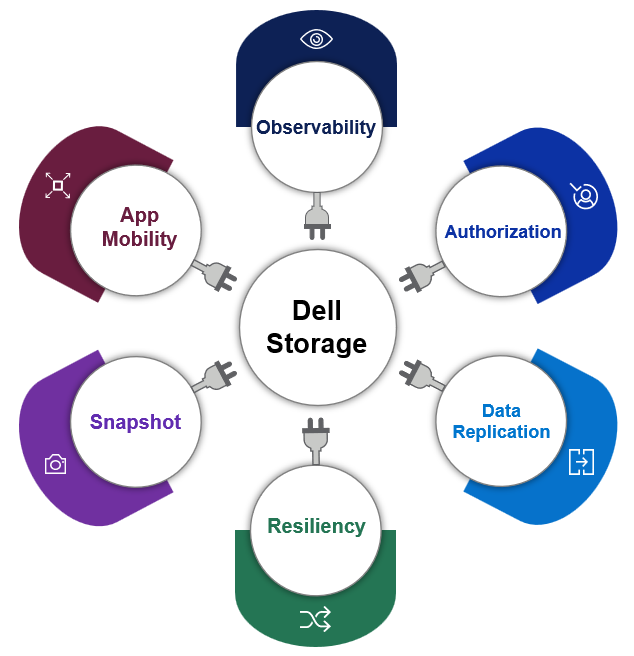

---
title: "Container Storage Modules"
linkTitle: "Container Storage Modules"
weight: 20
menu:
  main:
    weight: 20
no_list: true
---

The Dell Technologies (Dell) Container Storage Modules (CSM) enables simple and consistent integration and automation experiences, extending enterprise storage capabilities to Kubernetes for cloud-native stateful applications. It reduces management complexity so developers can independently consume enterprise storage with ease and automate daily operations such as provisioning, snapshotting, replication, observability, authorization, application mobility, encryption, and resiliency.

   
CSM is made up of multiple components including modules (enterprise capabilities), CSI drivers (storage enablement), and other related applications (deployment, feature controllers, etc).


  
  CSM for Authorization provides storage and Kubernetes administrators the ability to apply RBAC for Dell CSI Drivers. It does this by deploying a proxy between the CSI driver and the storage system to enforce role-based access and usage rules. 
[...Learn more](authorization/)

  
  
  CSM for Replication project aims to bring Replication & Disaster Recovery capabilities of Dell Storage Arrays to Kubernetes clusters. It helps you replicate groups of volumes and can provide you a way to restart applications in case of both planned and unplanned migration.
[...Learn more](replication/)




  CSM for Resiliency is designed to make Kubernetes Applications, including those that utilize persistent storage, more resilient to various failures.
[...Learn more](resiliency/)
  

 CSM for Observability provides visibility on the capacity of the volumes/file shares that is being managed with Dell CSM CSI (Container Storage Interface) drivers along with their performance in terms of bandwidth, IOPS, and response time.
[...Learn more](observability/)
  



  Container Storage Modules for Application Mobility provide Kubernetes administrators the ability to clone their stateful application workloads and application data to other clusters, either on-premise or in the cloud.
  [...Learn more](applicationmobility/)
  
   
  Encryption provides the capability to encrypt user data residing on volumes created by Dell CSI Drivers.
   [...Learn more](secure/encryption/)
  


   
  The tech-preview releases of Application Mobility and Encryption require a license.
  Request a license using the [Container Storage Modules License Request](https://app.smartsheet.com/b/form/5e46fad643874d56b1f9cf4c9f3071fb) by providing the requested details.
   [...Learn more](license/)
  


## CSM Supported Modules and Dell CSI Drivers

| Modules/Drivers                                                                              | CSM 1.5 | [CSM 1.4](../v1/) | [CSM 1.3](../v2/) | [CSM 1.2.1](../v3/) |
| -------------------------------------------------------------------------------------------- | :-----: | :---------------: | :---------------: | :-----------------: |
| [Authorization](https://hub.docker.com/r/dellemc/csm-authorization-sidecar)                  | v1.5.0  |      v1.4.0       |      v1.3.0       |       v1.2.0        |
| [Observability](https://hub.docker.com/r/dellemc/csm-topology)                               | v1.4.0  |      v1.3.0       |      v1.2.0       |       v1.1.1        |
| [Replication](https://hub.docker.com/r/dellemc/dell-replication-controller)                  | v1.3.1  |      v1.3.0       |      v1.3.0       |       v1.2.0        |
| [Resiliency](https://hub.docker.com/r/dellemc/podmon)                                        | v1.4.0  |      v1.3.0       |      v1.2.0       |       v1.1.0        |
| [Encryption](https://hub.docker.com/r/dellemc/csm-encryption)                                | v0.2.0  |      v0.1.0       |        NA         |         NA          |
| [Application Mobility](https://hub.docker.com/r/dellemc/csm-application-mobility-controller) | v0.2.0  |      v0.1.0       |        NA         |         NA          |
| [CSI Driver for PowerScale](https://hub.docker.com/r/dellemc/csi-isilon/tags)                | v2.5.0  |      v2.4.0       |      v2.3.0       |       v2.2.0        |
| [CSI Driver for Unity XT](https://hub.docker.com/r/dellemc/csi-unity/tags)                   | v2.5.0  |      v2.4.0       |      v2.3.0       |       v2.2.0        |
| [CSI Driver for PowerStore](https://hub.docker.com/r/dellemc/csi-powerstore/tags)            | v2.5.0  |      v2.4.0       |      v2.3.0       |       v2.2.0        |
| [CSI Driver for PowerFlex](https://hub.docker.com/r/dellemc/csi-vxflexos/tags)               | v2.5.0  |      v2.4.0       |      v2.3.0       |       v2.2.0        |
| [CSI Driver for PowerMax](https://hub.docker.com/r/dellemc/csi-powermax/tags)                | v2.5.0  |      v2.4.0       |      v2.3.0       |       v2.2.0        |

## CSM Modules Support Matrix for Dell CSI Drivers 

| CSM Module                                                  | CSI PowerFlex v2.5.0 | CSI PowerScale v2.5.0 | CSI PowerStore v2.5.0 | CSI PowerMax v2.5.0 | CSI Unity XT v2.5.0 |
| ----------------------------------------------------------- | -------------------- | --------------------- | --------------------- | ------------------- | ------------------- |
| [**Authorization**](authorization/) v1.5                    | ✔️                    | ✔️                     | ❌                     | ✔️                   | ❌                   |
| [**Observability**](observability/) v1.4                    | ✔️                    | ✔️                     | ✔️                     | ❌                   | ❌                   |
| [**Replication**](replication/)   v1.3.1                    | ❌                    | ✔️                     | ✔️                     | ✔️                   | ❌                   |
| [**Resiliency**](resiliency/)     v1.4                      | ✔️                    | ✔️                     | ❌                     | ❌                   | ✔️                   |
| [**Encryption**](secure/encryption)    v0.2.0               | ❌                    | ✔️                     | ❌                     | ❌                   | ❌                   |
| [**Application Mobility**](applicationmobility/)     v0.2.0 | ✔️                    | ✔️                     | ✔️                     | ✔️                   | ✔️                   |
