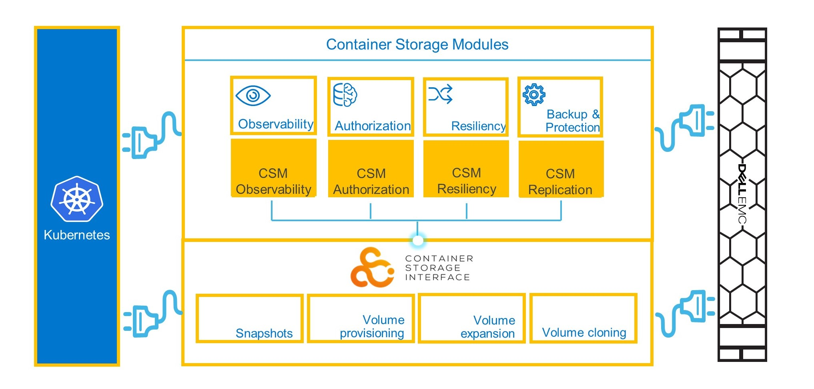

---
title: "Dell Technologies (Dell) Container Storage Modules (CSM)"
linkTitle: "Dell Technologies (Dell) Container Storage Modules (CSM)"
weight: 20
menu:
  main:
    weight: 20
---

The Dell Technologies (Dell) Container Storage Modules (CSM) enables simple and consistent integration and automation experiences, extending enterprise storage capabilities to Kubernetes for cloud-native stateful applications. It reduces management complexity so developers can independently consume enterprise storage with ease and automate daily operations such as provisioning, snapshotting, replication, observability, authorization and, resiliency.

CSM is made up of multiple components including modules (enterprise capabilities), CSI drivers (storage enablement) and, other related applications (deployment, feature controllers, etc).

## CSM Supported Modules and Dell CSI Drivers

| Modules/Drivers | CSM 1.3 | [CSM 1.2.1](../v1/) | [CSM 1.2](../v2/) | [CSM 1.1](../v3/) | 
| - | :-: | :-: | :-: | :-: |
| [Authorization](https://hub.docker.com/r/dellemc/csm-authorization-sidecar) | v1.3.0 | v1.2.0 | v1.2.0 | v1.1.0 |
| [Observability](https://hub.docker.com/r/dellemc/csm-topology) | v1.2.0 | v1.1.1 | v1.1.0 | v1.0.1 |
| [Replication](https://hub.docker.com/r/dellemc/dell-csi-replicator) | v1.3.0 | v1.2.0 | v1.2.0 | v1.1.0 |
| [Resiliency](https://hub.docker.com/r/dellemc/podmon) | v1.2.0 | v1.1.0 | v1.1.0 | v1.0.1 |
| [CSI Driver for PowerScale](https://hub.docker.com/r/dellemc/csi-isilon/tags) | v2.3.0 | v2.2.0 | v2.2.0 | v2.1.0 | 
| [CSI Driver for Unity XT](https://hub.docker.com/r/dellemc/csi-unity/tags) | v2.3.0 | v2.2.0 | v2.2.0 | v2.1.0 |
| [CSI Driver for PowerStore](https://hub.docker.com/r/dellemc/csi-powerstore/tags) | v2.3.0 | v2.2.0 | v2.2.0| v2.1.0 |
| [CSI Driver for PowerFlex](https://hub.docker.com/r/dellemc/csi-vxflexos/tags) | v2.3.0 | v2.2.0 | v2.2.0 | v2.1.0 |
| [CSI Driver for PowerMax](https://hub.docker.com/r/dellemc/csi-powermax/tags) | v2.3.0 | v2.2.0 | v2.2.0 | v2.1.0 |

## CSM Modules Support Matrix for Dell CSI Drivers 

| CSM Module        | CSI PowerFlex v2.3.0 | CSI PowerScale v2.3.0 | CSI PowerStore v2.3.0 | CSI PowerMax v2.3.0 | CSI Unity XT v2.3.0    |
| ----------------- | -------------- | --------------- | --------------- | ------------- | --------------- |
| Authorization v1.3| ✔️              | ✔️               | ❌              | ✔️             | ❌            |
| Observability v1.2| ✔️              | ❌              | ✔️               | ❌            | ❌            |
| Replication   v1.3| ❌             | ✔️              | ✔️               | ✔️             | ❌            |
| Resiliency     v1.2| ✔️              | ✔️              | ❌              | ❌            | ✔️             |
