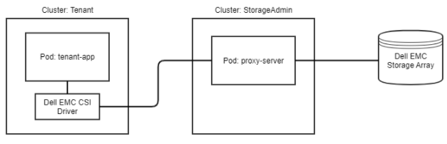
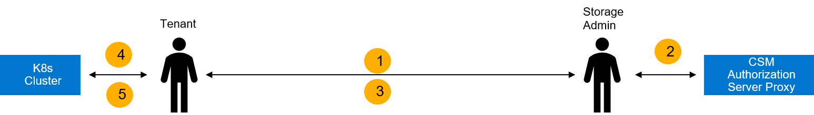

[Container Storage Modules](https://github.com/dell/csm) (CSM) for Authorization is part of the  open-source suite of Kubernetes storage enablers for Dell products. 

CSM for Authorization provides storage and Kubernetes administrators the ability to apply RBAC for Dell CSI Drivers. It does this by deploying a proxy between the CSI driver and the storage system to enforce role-based access and usage rules.

Storage administrators of compatible storage platforms will be able to apply quota and RBAC rules that instantly and automatically restrict cluster tenants usage of storage resources. Users of storage through CSM for Authorization do not need to have storage admin root credentials to access the storage system.

Kubernetes administrators will have an interface to create, delete, and manage roles/groups that storage rules may be applied. Administrators and/or users may then generate authentication tokens that may be used by tenants to use storage with proper access policies being automatically enforced.

The following diagram shows a high-level overview of CSM for Authorization with a `tenant-app` that is using a CSI driver to perform storage operations through the CSM for Authorization `proxy-server` to access the a Dell storage system. All requests from the CSI driver will contain the token for the given tenant that was granted by the Storage Administrator.

## CSM for Authorization Capabilities

| Feature | PowerFlex | PowerMax | PowerScale | Unity XT | PowerStore |
| - | - | - | - | - | - |
| Ability to set storage quota limits to ensure k8s tenants are not overconsuming storage | Yes | Yes | No (natively supported) | No | No |
| Ability to create access control policies to ensure k8s tenant clusters are not accessing storage that does not belong to them | Yes | Yes | No (natively supported) | No | No |
| Ability to shield storage credentials from Kubernetes administrators ensuring credentials are only handled by storage admins | Yes | Yes | Yes | No | No |


**NOTE:** PowerScale OneFS implements its own form of Role-Based Access Control (RBAC). CSM for Authorization does not enforce any role-based restrictions for PowerScale. To configure RBAC for PowerScale, refer to the PowerScale OneFS [documentation](https://www.dell.com/support/home/en-us/product-support/product/isilon-onefs/docs).

## Supported Operating Systems/Container Orchestrator Platforms

| COP/OS | Supported Versions |
|-|-|
| Kubernetes    | 1.22, 1.23, 1.24 |
| RHEL          |     7.x, 8.x      |
| CentOS        |     7.8, 7.9     |


## Supported Storage Platforms


|               | PowerMax         | PowerFlex | PowerScale |
|---------------|:----------------:|:-------------------:|:----------------:|
| Storage Array |PowerMax 2000/8000   PowerMax 2500/8500   5978.479.479, 5978.711.711, 6079.xxx.xxx, Unisphere 10.0|    3.5.x, 3.6.x    | OneFS 8.1, 8.2, 9.0, 9.1, 9.2, 9.3 |


## Supported CSI Drivers

CSM for Authorization supports the following CSI drivers and versions.

| Storage Array | CSI Driver | Supported Versions |
| ------------- | ---------- | ------------------ |
| CSI Driver for Dell PowerFlex | [csi-powerflex](https://github.com/dell/csi-powerflex) | v2.0 + |
| CSI Driver for Dell PowerMax | [csi-powermax](https://github.com/dell/csi-powermax) | v2.0 + |
| CSI Driver for Dell PowerScale | [csi-powerscale](https://github.com/dell/csi-powerscale) | v2.0 + |


**NOTE:** If the deployed CSI driver has a number of controller pods equal to the number of schedulable nodes in your cluster, CSM for Authorization may not be able to inject properly into the driver's controller pod.
To resolve this, please refer to our [troubleshooting guide](./troubleshooting) on the topic.

## Authorization Components Support Matrix
CSM for Authorization consists of 2 components - the Authorization sidecar and the Authorization proxy server.  It is important that the version of the Authorization sidecar image maps to a supported version of the Authorization proxy server.


| Authorization Sidecar Image Tag | Authorization Proxy Server Version |
| ------------------------------- | ---------------------------------- |
| dellemc/csm-authorization-sidecar:v1.0.0 | v1.0.0, v1.1.0 |
| dellemc/csm-authorization-sidecar:v1.2.0 | v1.1.0, v1.2.0 |
| dellemc/csm-authorization-sidecar:v1.3.0 | v1.1.0, v1.2.0, v1.3.0 |
| dellemc/csm-authorization-sidecar:v1.4.0 | v1.1.0, v1.2.0, v1.3.0, v1.4.0 |
| dellemc/csm-authorization-sidecar:v1.5.0 | v1.1.0, v1.2.0, v1.3.0, v1.4.0, v1.5.0 |
| dellemc/csm-authorization-sidecar:v1.5.1 | v1.1.0, v1.2.0, v1.3.0, v1.4.0, v1.5.0, v1.5.1 |
| dellemc/csm-authorization-sidecar:v1.6.0 | v1.1.0, v1.2.0, v1.3.0, v1.4.0, v1.5.0, v1.5.1, v1.6.0 |

## Roles and Responsibilities

The CSM for Authorization CLI can be executed in the context of the following roles:
- Storage Administrators
- Kubernetes Tenant Administrators

### Storage Administrators

Storage Administrators can perform the following operations within CSM for Authorization

- Tenant Management (create, get, list, delete, bind roles, unbind roles)
- Token Management (generate, revoke)
- Storage System Management (create, get, list, update, delete)
- Storage Access Roles Management (assign to a storage system with an optional quota)

### Tenant Administrators

Tenants of CSM for Authorization can use the token provided by the Storage Administrators in their storage requests.

### Workflow

1) Tenant Admin requests storage from a Storage Admin.
2) Storage Admin uses CSM Authorization CLI to: 
    a) Create a tenant resource. 
    b) Create a role permitting desired storage access. 
    c) Assign the role to the tenant and generate a token. 
3) Storage Admin returns a token to the Tenant Admin.
4) Tenant Admin inputs the Token into their Kubernetes cluster as a Secret.
5) Tenant Admin updates CSI driver with CSM Authorization sidecar module.

