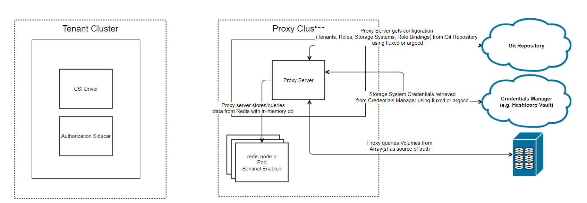

>> NOTE: This tech-preview release is not intended for use in production environment.

>> NOTE: Only supported on PowerFlex.

The following diagram shows a high-level overview of CSM for Authorization with a `tenant-app` that is using a CSI driver to perform storage operations through the CSM for Authorization `proxy-server` to access the a Dell storage system. All requests from the CSI driver will contain the token for the given tenant that was granted by the Storage Administrator.

This is the introduction to a Stateless Architecture for Authorization. The creation of storage, roles, and tenants is done through Custom Resources (CRs) which are tracked and contained within CSM Authorization. The underlying communication is consistent with the previous architecture which makes the creation of volumes and snapshots seamless.

## CSM for Authorization Capabilities

| Feature                                                                                                                        | PowerFlex | PowerMax | PowerScale |
| -----------------------------------------------------------------------------------------------------------------------------  | --------- | -------- | ---------- |
| Ability to set storage quota limits to ensure k8s tenants are not overconsuming storage                                        | Yes       | Yes      | No         |
| Ability to create access control policies to ensure k8s tenant clusters are not accessing storage that does not belong to them | Yes       | Yes      | No         |
| Ability to shield storage credentials from Kubernetes administrators by storing them in vault                                  | Yes       | No       | No         |
| Ability to create snapshots from owned volumes that consume the storage quota                                                  | Yes       | No       | No         |
| Ability to periodically query storage array to keep quota consumption in sync                                                  | Yes       | No       | No         |


## Roles and Responsibilities

The Stateless CSM Authorization contains the following roles:
- Storage Administrators
- Kubernetes Tenant Administrators

### Storage Administrators

Storage Administrators perform the following:

- Storage System Management (create, get, delete)
- Role Management (create, get, delete)
- Tenant Management (create, get, delete)

For more information on the configuration of the above, see the configuration of the [Proxy Server](../v2.0-tech-preview/configuration/proxy-server/#configuring-storage).

### Tenant Administrators

Tenants of CSM for Authorization can use dellctl to generate a token for the configured tenant  by the Storage Administrators.

For more information on the token generation, see the configuration for the [PowerFlex driver](../v2.0-tech-preview/configuration/powerflex).