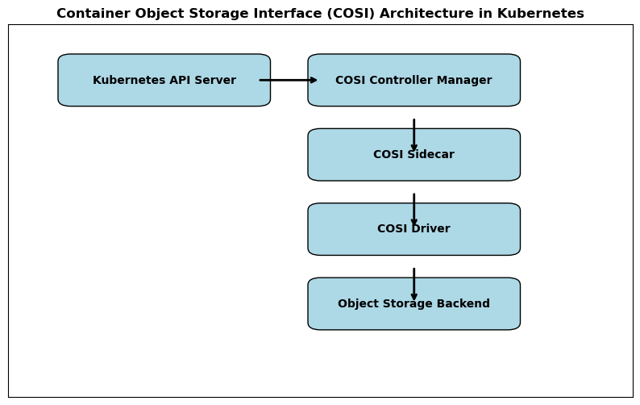

 

 
The Container Object Storage Interface (COSI) is a Kubernetes-native standard for managing object storage, similar to how the Container Storage Interface (CSI) manages block and file storage.

The Dell COSI Driver is a Kubernetes plug-in that integrates COSI-enabled container orchestrators with Dell storage arrays. It enables seamless provisioning and access to object storage using Dell’s enterprise storage platforms.

The Dell COSI Driver supports multiple Object Storage Platform (OSP) instances, allowing users to connect and manage several backends through a single, unified COSI interface.

The diagram below illustrates the architecture of the Container Object Storage Interface (COSI) in Kubernetes:

</img>

### Components

- **Kubernetes API Server**: Handles bucket provisioning and access requests.
- **COSI Controller Manager**: Manages the lifecycle of buckets and access objects.
- **COSI Sidecar**: Translates Kubernetes API calls into gRPC requests.
- **COSI Driver**: Vendor-specific implementation that communicates with the object storage backend.
- **Object Storage Backend**: The actual storage system (e.g., Dell ObjectScale, AWS S3).

 

 

### Supported Container Orchestrator Platforms

> ℹ️ **NOTE:** during technical preview, no certification is performed. The platforms listed below were tested by developers using integration test suite.


|            |    COSI    |
|------------|:----------:|
|  
 Kubernetes |    1.27    |
| 
  K3s        |    1.27    |


### COSI Driver Capabilities


| Features               | ObjectScale |
|------------------------|:-----------:|
|  
 Bucket Creation        |     Yes     |
|  
 Bucket Deletion        |     Yes     |
|  
 Bucket Access Granting |     Yes     |
|  
 Bucket Access Revoking |     Yes     |


### Storage Protocols


| Protocol   | ObjectScale |
|------------|:-----------:|
|  
 AWS S3     |     Yes     |
|  
 GCS        |     N/A     |
|  
 Azure Blob |     N/A     |


### Dell Storage Platforms


| Storage Platform | Versions |
|------------------|:--------:|
| 
  ObjectScale      |  1.2.x   |


> **NOTE:** Object Scale 1.2.x is planned for End of Standard Support on January 31st 2025. Please refer <a href="https://www.dell.com/support/kbdoc/en-uk/000185734/all-dell-emc-end-of-life-documents?lang=en">Dell Support documentation</a> for more information. We plan to support COSI driver when a new version of ObjectScale is available.

### Bucket Lifecycle Workflow

1. Create Bucket &rarr; Delete Bucket
1. Create Bucket &rarr; Grant Access &rarr; Revoke Access &rarr; Delete Bucket

### ObjectScale


| Area              | Core Features          |  Implementation level   |     Status      | Details                                                                                     |
|:------------------|:-----------------------|:-----------------------:|:---------------:|---------------------------------------------------------------------------------------------|
| Provisioning      | _Create Bucket_        | Minimum Viable Product  |     ✅ Done      | Bucket is created using default settings.                                                   |
|                   |                        | Brownfield provisioning |     ✅ Done      | Bucket is created based on existing bucket in Object Storage Provisioner.                   |
|                   |                        |  Advanced provisioning  | 📝 Design draft | Extra (non-default) parameters for bucket provisioning are controlled from the BucketClass. |
|                   | _Delete Bucket_        | Minimum Viable Product  |     ✅ Done      | Bucket is deleted.                                                                          |
| Access Management | _Grant Bucket Access_  | Minimum Viable Product  |     ✅ Done      | Full access is granted for given bucket.                                                    |
|                   |                        |  Advanced permissions   | 📝 Design draft | More control over permission is done through BucketAccessClass.                             |
|                   | _Revoke Bucket Access_ | Minimum Viable Product  |     ✅ Done      | Access is revoked.                                                                          |


 

### Storage Details


      

 

### Installation, Upgrade, Uninstallation and Troubleshooting Details
.


       

      

      

      

 