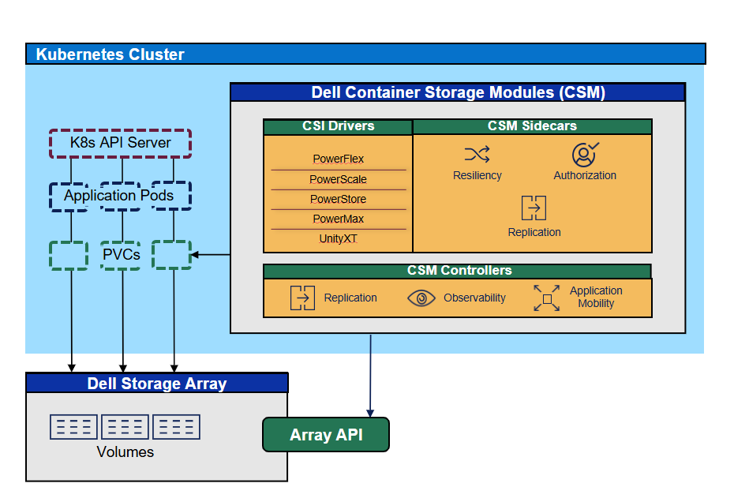

 

 
**Overview** : Container Storage Interface ([CSI](https://kubernetes-csi.github.io/docs/)) is a standardized model designed to integrate storage systems with Kubernetes and other orchestration platforms. Since Kubernetes version 1.10, CSI has been supported in beta, enabling seamless storage integration.

CSI allows storage drivers to operate independently of Kubernetes updates, providing storage vendors the flexibility to release, upgrade, and enhance their drivers on their own schedules. This ensures that Kubernetes remains a stable and reliable orchestration system while accommodating advancements in storage technology.

With Container Storage Modules (CSM) utilizing CSI, you can perform various storage operations efficiently and effectively.

!CSM Architecture ./csm_arc.png
 

