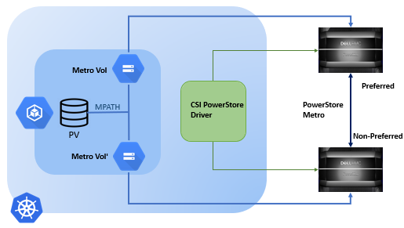

## PowerStore Metro Architecture



In PowerStore Metro configurations:
* The application host can write data to both sides of the Metro volume.
* The devices in the Metro volume are configured with the same external device identity, including the geometry and device WWN.
* When Metro is configured on the volume, the PowerStore system from which the metro source is configured is automatically set as preferred and the other is configured as non-preferred.

With respect to Kubernetes, the PowerStore Metro mode works in single cluster scenarios. When utilizing Metro, both the arrays—[arrays with metro link setup between them](../../../../getting-started/installation/kubernetes/powerstore/helm/csm-modules/replication/csi-driver/#on-storage-array)—involved in the replication are managed by the same `csi-powerstore` driver. The replication is triggered by creating a volume using a `StorageClass` with metro-related parameters.
The driver on receiving the metro-related parameters in the `CreateVolume` call creates a metro replicated volume and the details about both the volumes are returned in the volume context to the Kubernetes cluster. The Persistent Volume (PV) created in the process represents a pair of metro replicated volumes. When a `PV`, representing a pair of metro replicated volumes, is claimed by a pod, the host treats each of the volumes represented by the single `PV` as a separate data path. The switching between the paths, to read and write the data, is managed by the multipath driver. The switching happens automatically, as configured by the user—in round-robin fashion or otherwise—or when one of the paths goes down. For details on Linux multipath driver setup, [click here](../../../../getting-started/installation/kubernetes/powerstore/prerequisite/#linux-multipathing-requirements).

The creation of volumes in metro mode doesn't involve the replication sidecar or the common replication controller, nor does it cause the creation of any replication related custom resources. It just needs the `csi-powerstore` driver that implements the `CreateVolume` gRPC endpoint with metro capability for it to work.

### Host Registration for PowerStore Metro
> **Deprecation Notice:**
> Use of `metroTopology` in conjunction with `labels` to configure optimized host registration for metro-enabled hosts is deprecated and remains only for
> purposes of backward compatibility.
>
> This configuration option has been replaced by `hostConnectivity`. Please follow the documentation below to configure
> the secret and enable this feature.

PowerStore supports optimized metro connections by registering hosts based on their location relative to PowerStore systems.

To enable this feature, add labels to the nodes, or make note of existing node labels, that describe the desired topology,
and use these labels to build node selector statements (`nodeSelectorTerms`) for the provided host connectivity options under `hostConnectivity.metro`.

The CSI driver checks node labels against the provided `nodeSelectorTerms`, and if a match is found, a host is registered for the node
with the corresponding metro optimization. If no match is found for the node, a regular, local-only host is registered for the node.

The following options are provided to describe the relationship between the cluster node and the PowerStore system:
- `colocatedLocal`: The worker node is located near the current PowerStore system.
- `colocatedRemote`: The worker node is located near the replication target of the current PowerStore system.
- `colocatedBoth`: The worker node is located near both the current PowerStore system and its replication pair.

`nodeSelectorTerms` follow Kubernetes' Node Affinity format -- `requiredDuringSchedulingIgnoredDuringExecution`. For more information, see
[Assigning Pods to Nodes: Node Affinity](https://kubernetes.io/docs/concepts/scheduling-eviction/assign-pod-node/#node-affinity), and for the full API
specification, see [Pod: NodeAffinity](https://kubernetes.io/docs/reference/kubernetes-api/workload-resources/pod-v1/#NodeAffinity).

> **Note:**
> For all connectivity options, `nodeSelectorTerms` should be mutually exclusive in the set of nodes the selectors match.
> In other words, there should be no overlap in the nodes each `nodeSelectorTerms` matches. If a node matches more than one connectivity option as defined by `nodeSelectorTerms`
> the driver will error and fail to register the host for the node.

_Example:_
There are two zones and two PowerStore systems, where the PowerStore systems have been configured for metro replication.
Zone-a has worker nodes co-located with array "unique1", and zone-b has worker nodes co-located with array "unique2".
Nodes in zone-a are labeled `topology.kubernetes.io/zone: zone-a`, and Nodes in zone-b are labeled `topology.kubernetes.io/zone: zone-b`.
```yaml
arrays:
  - endpoint: "https://11.0.0.1/api/rest"
    globalID: "unique1"
    username: "user"
    password: "password"
    skipCertificateValidation: true
    blockProtocol: "FC"
    hostConnectivity:
      metro:
        colocatedLocal:
          nodeSelectorTerms:
            - matchExpressions:
              - key: "topology.kubernetes.io/zone"
                operation: "In"
                values:
                  - "zone-a"
        colocatedRemote:
          nodeSelectorTerms:
            - matchExpressions:
              - key: "topology.kubernetes.io/zone"
                operation: "In"
                values:
                  - "zone-b"
  - endpoint: "https://11.0.0.2/api/rest"
    globalID: "unique2"
    username: "user"
    password: "password"
    skipCertificateValidation: true
    blockProtocol: "FC"
    hostConnectivity:
      metro:
        colocatedLocal:
          nodeSelectorTerms:
            - matchExpressions:
              - key: "topology.kubernetes.io/zone"
                operation: "In"
                values:
                  - "zone-b"
        colocatedRemote:
          nodeSelectorTerms:
            - matchExpressions:
              - key: "topology.kubernetes.io/zone"
                operation: "In"
                values:
                  - "zone-a"
```

### StorageClass
The Metro replicated volumes are created just like the normal volumes, but the `StorageClass` contains some
extra parameters related to metro replication. A `StorageClass` to create metro replicated volumes may look as follows:

Example using`volumeBindingMode: Immediate`

```yaml
apiVersion: storage.k8s.io/v1
kind: StorageClass
metadata:
  name: powerstore-metro
parameters:
  arrayID: PS000000000001
  replication.storage.dell.com/isReplicationEnabled: "true"
  replication.storage.dell.com/mode: METRO
  replication.storage.dell.com/remoteSystem: RT-D0002
allowVolumeExpansion: true
provisioner: csi-powerstore.dellemc.com
reclaimPolicy: Delete
volumeBindingMode: Immediate
```

Example using `volumeBindingMode: WaitForFirstConsumer`

```yaml
apiVersion: storage.k8s.io/v1
kind: StorageClass
metadata:
  name: powerstore-metro
parameters:
  arrayID: PS000000000001
  replication.storage.dell.com/isReplicationEnabled: "true"
  replication.storage.dell.com/mode: METRO
  replication.storage.dell.com/remoteSystem: RT-D0002
allowVolumeExpansion: true
provisioner: csi-powerstore.dellemc.com
reclaimPolicy: Delete
volumeBindingMode: WaitForFirstConsumer
allowedTopologies:
- matchLabelExpressions:
  - key: csi-powerstore.dellemc.com/xx.xxx.xx.xx-iscsi
    values: ["true"]
  - key: csi-powerstore.dellemc.com/xx.xx.xx.xx-iscsi
    values: ["true"]
```

> _**NOTE:**_
> - Metro support for hosts with Linux operating systems was added from [PowerStoreOS 4.0](https://infohub.delltechnologies.com/en-us/l/dell-powerstore-metro-volume-1/introduction-4503/).</br>
> - Metro volume groups are not supported by the PowerStore driver.

When a Metro `PV` is created, the volumeHandle will have the format `<volumeID/globalID/protocol:remote-volumeID/remote-globalID>`.

### PowerStore Metro volume expansion
When a request is made to increase the size of a Metro `PV`, the metro replication session must be temporarily paused prior to the editing of Kubernetes resources. This can be done from the PowerStore Manager UI or CLI. The size of the local/preferred volume is then increased. The metro session must then be manually resumed. It is important to note that the paths for the remote/non-preferred volume will not become active until the metro session is resumed and the remote/non-preferred volume reflects the updated size.

### Snapshots on PowerStore Metro volumes
When a VolumeSnapshot object is created for the Metro `PV`, snapshots are created on each side of the Metro session on the PowerStore systems. However, the VolumeSnapshot object only refers to the local/preferred side of the Metro volume. When a Metro `PV` is deleted, the remote/non-preferred volume, along with any snapshots associated with it, is also automatically deleted.

### Limitations
- PowerStore driver only supports uniform host configuration for Metro volume where the host has active paths to both PowerStore systems.
- Metro configuration needs to be done by the user by adding zone keys as node labels as per the configuration requirements.
- Powerstore driver does only fresh host registration for metro configuration. To modify an existing host entry, the user will have to remove the existing host entry from the array and restart node pods to enable the Powerstore driver to create fresh host entry.
- VolumeGroup Metro support is not currently available for uniform host configuration.
- Metro volume only supports FC and iSCSI protocols for host access.
- Each Kubernetes node is automatically registered as a host object on both PowerStore systems when the node pods are running. However, the connectivity type of the host is set to 'Local Connectivity' by default. It needs to be updated manually with the correct 'Metro connectivity' option on both PowerStore systems using the PowerStore Manager UI.
- Actions that need to be performed on the Metro session, such as pausing, resuming, or changing the preferred side, can only be done through the PowerStore Manager UI.
- Some CSI Driver Capabilities, such as snapshot or clone, are not supported on the remote/non-preferred side of the Metro volume.
- While restoring a Metro snapshot or cloning a Metro volume on the local/preferred side, provide a non-Metro storage class. Configuring Metro on clones is not supported on the PowerStore.
- The following [volume attributes](../../../csidriver/features/powerstore/#configurable-volume-attributes-optional) on PersistentVolumeClaims (PVCs) are not supported for Metro volumes: `csi.dell.com/volume_group_id`, `csi.dell.com/protection_policy_id` if the policy has replication rule.
