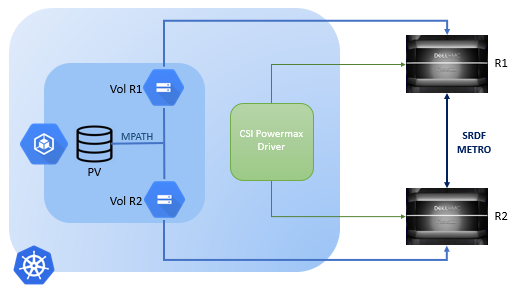

## PowerStore Metro Architecture



In PowerStore Metro configurations:
* The application host can write data to both sides of the Metro volume.
* The devices in the Metro volume are configured with the same external device identity, including the geometry and device WWN.
* When Metro is configured on the volume, the PowerStore system from which the metro source is configured is automatically set as preferred and the other is configured as non-preferred.

With respect to Kubernetes, the PowerStore Metro mode works in single cluster scenarios. When utilizing Metro, both the arrays—[arrays with metro link setup between them](../../../../getting-started/installation/kubernetes/powerstore/helm/csm-modules/replication/csi-driver/#on-storage-array)—involved in the replication are managed by the same `csi-powerstore` driver. The replication is triggered by creating a volume using a `StorageClass` with metro-related parameters.
The driver on receiving the metro-related parameters in the `CreateVolume` call creates a metro replicated volume and the details about both the volumes are returned in the volume context to the Kubernetes cluster. The Persistent Volume (PV) created in the process represents a pair of metro replicated volumes. When a `PV`, representing a pair of metro replicated volumes, is claimed by a pod, the host treats each of the volumes represented by the single `PV` as a separate data path. The switching between the paths, to read and write the data, is managed by the multipath driver. The switching happens automatically, as configured by the user—in round-robin fashion or otherwise—or when one of the paths goes down. For details on Linux multipath driver setup, [click here](../../../../getting-started/installation/kubernetes/powerstore/prerequisite/#linux-multipathing-requirements).

The creation of volumes in metro mode doesn't involve the replication sidecar or the common replication controller, nor does it cause the creation of any replication related custom resources. It just needs the `csi-powerstore` driver that implements the `CreateVolume` gRPC endpoint with metro capability for it to work.

### Host Registration for Powerstore Metro
CSM PowerStore supports registering worker nodes as new hosts using `Metro Connectivity`. To enable this, you need to set the `metroTopology` to `Uniform` in the array's secret configuration. 

To manage your setup:

Label the worker nodes: Add zone labels to the worker nodes.
#### Zone Identification:
* Nodes in the same zone as the array configuration are considered the current system.
* Nodes in different zones are considered the remote system.


```yaml
arrays:
  - endpoint: "https://11.0.0.1/api/rest"
    globalID: "unique1"
    username: "user"
    password: "password"
    skipCertificateValidation: true
    blockProtocol: "FC"
    metroTopology: Uniform
    labels:
      topology.kubernetes.io/zone: zone1
  - endpoint: "https://11.0.0.2/api/rest"
    globalID: "unique2"
    username: "user"
    password: "password"
    skipCertificateValidation: true
    blockProtocol: "FC"    
    metroTopology: Uniform
    labels:
      topology.kubernetes.io/zone: zone2
```

* The node that match the array's topology zone key will be registered as `Host is co-located with this system`
* The node that does not match the array's topology zone key will be registered as `Host is co-located with remote system`
* When both worker nodes have the same topology key as the array's topology zone key, then both nodes will be registered as `Co-located with both systems`
* When the node does not have any zone keys in its label, the host is registered as `Local connectivity`

### Usage
The Metro replicated volumes are created just like the normal volumes, but the `StorageClass` contains some
extra parameters related to metro replication. A `StorageClass` to create metro replicated volumes may look as follows:

```yaml
apiVersion: storage.k8s.io/v1
kind: StorageClass
metadata:
  name: powerstore-metro
parameters:
  arrayID: PS000000000001
  replication.storage.dell.com/isReplicationEnabled: "true"
  replication.storage.dell.com/mode: METRO
  replication.storage.dell.com/remoteSystem: RT-D0002
allowVolumeExpansion: true
provisioner: csi-powerstore.dellemc.com
reclaimPolicy: Delete
volumeBindingMode: Immediate
```

> _**NOTE**_: Metro support for hosts with Linux operating systems was added from [PowerStoreOS 4.0](https://infohub.delltechnologies.com/en-us/l/dell-powerstore-metro-volume-1/introduction-4503/).</br>
> _**NOTE**_: Metro at volume group is not supported by the PowerStore driver.

When a Metro `PV` is created, the volumeHandle will have the format `<volumeID/globalID/protocol:remote-volumeID/remote-globalID>`.

### PowerStore Metro volume expansion
When a request is made to increase the size of a Metro `PV`, the metro replication session must be temporarily paused prior to the editing of Kubernetes resources. This can be done from the PowerStore Manager UI or CLI. The size of the local/preferred volume is then increased. The metro session must then be manually resumed. It is important to note that the paths for the remote/non-preferred volume will not become active until the metro session is resumed and the remote/non-preferred volume reflects the updated size.

### Snapshots on PowerStore Metro volumes
When a VolumeSnapshot object is created for the Metro `PV`, snapshots are created on each side of the Metro session on the PowerStore systems. However, the VolumeSnapshot object only refers to the local/preferred side of the Metro volume. When a Metro `PV` is deleted, the remote/non-preferred volume, along with any snapshots associated with it, is also automatically deleted.

### Limitations
- PowerStore driver only supports uniform host configuration for Metro volume where the host has active paths to both PowerStore systems.
- Metro configuration needs to be done by the user by adding zone keys as node labels as per the configuration requirements.
- Powerstore driver does only fresh host registration for metro configuration. To modify an existing host entry, the user will have to remove the existing host entry from the array and restart node pods to enable the Powerstore driver to create fresh host entry.
- VolumeGroup Metro support is not currently available for uniform host configuration.
- Metro volume only supports FC and iSCSI protocols for host access.
- Each Kubernetes node is automatically registered as a host object on both PowerStore systems when the node pods are running. However, the connectivity type of the host is set to 'Local Connectivity' by default. It needs to be updated manually with the correct 'Metro connectivity' option on both PowerStore systems using the PowerStore Manager UI.
- Actions that need to be performed on the Metro session, such as pausing, resuming, or changing the preferred side, can only be done through the PowerStore Manager UI.
- Some CSI Driver Capabilities, such as snapshot or clone, are not supported on the remote/non-preferred side of the Metro volume.
- While restoring a Metro snapshot or cloning a Metro volume on the local/preferred side, provide a non-Metro storage class. Configuring Metro on clones is not supported on the PowerStore.
- The following [volume attributes](../../../csidriver/features/powerstore/#configurable-volume-attributes-optional) on PersistentVolumeClaims (PVCs) are not supported for Metro volumes: `csi.dell.com/volume_group_id`, `csi.dell.com/protection_policy_id` if the policy has replication rule.
