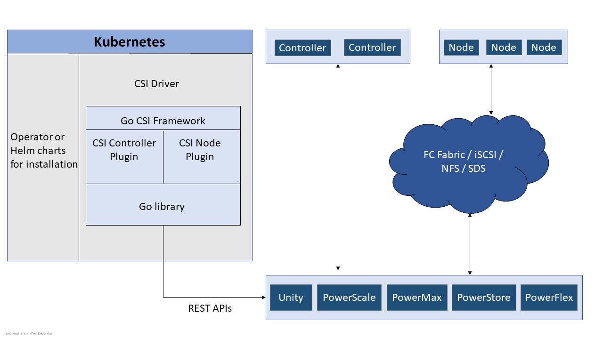

---
title: "CSI Drivers"
linkTitle: "CSI Drivers"
description: About Dell Technologies (Dell) CSI Drivers 
weight: 3
---

The CSI Drivers by Dell implement an interface between [CSI](https://kubernetes-csi.github.io/docs/) (CSI spec v1.6) enabled Container Orchestrator (CO) and Dell Storage Arrays. It is a plug-in that is installed into Kubernetes to provide persistent storage using the Dell storage system.

## Features and capabilities

### Supported Container Orchestrator Platforms


|               | PowerMax         | PowerFlex           | Unity XT         | PowerScale        | PowerStore       |
|---------------|:----------------:|:-------------------:|:----------------:|:-----------------:|:----------------:|
| Kubernetes    | 1.25, 1.26, 1.27 | 1.26, 1.27, 1.28    | 1.26, 1.27, 1.28 | 1.26, 1.27, 1.28  | 1.26, 1.27, 1.28 |
| Red Hat OpenShift | 4.12, 4.12 EUS, 4.13 | 4.12, 4.12 EUS, 4.13 | 4.12, 4.12 EUS, 4.13 | 4.12, 4.12 EUS, 4.13 | 4.12, 4.13, 4.13 EUS |
| Mirantis Kubernetes Engine | 3.6.x |     3.6.x         |       3.6.x      | 3.5.x, 3.6.x      |        3.6.x     |
| Google Anthos |        1.15      |          1.15       |        no        |         1.15      |        1.15      |
| VMware Tanzu  |        no        |          no         |        NFS       |         NFS       |      NFS,iSCSI   |
| Rancher Kubernetes Engine | 1.4.1|          1.4.7      |        1.4.8     |         1.4.7     |      1.4.5       |
| Amazon Elastic Kubernetes Service  Anywhere | yes  | yes  |   yes      |        yes        |      yes         |
| Kubernetes K3s Engine on Debian OS |     no    |  no   |      1.26, 1.27, 1.28  |        no         |        no        |
| OS dependencies | iscsi-initiator-utils multipathd or powerpath nvme-cli nfs-utils | - |    iscsi-initiator-utils multipathd nfs-utils | nfs-utils | iscsi-initiator-utils multipathd nvme-cli nfs-utils |


> Notes:
> * The required OS dependencies are only for the protocol needed (e.g. if NVMe isn't the storage access protocol then nvme-cli is not required).
> * The host operating system/version being used must align with what each Dell Storage platform supports. Please visit [E-Lab Navigator](https://elabnavigator.dell.com/eln/modernHomeSSM) for specific Dell Storage platform host operating system level support matrices.

### CSI Driver Capabilities

| Features                 | PowerMax | PowerFlex | Unity XT  | PowerScale | PowerStore |
|--------------------------|:--------:|:---------:|:---------:|:----------:|:----------:|
| CSI Driver version       | 2.9.0    | 2.9.0     | 2.9.0     | 2.9.0      | 2.9.0      |
| Static Provisioning      | yes      | yes       | yes       | yes        | yes        |
| Dynamic Provisioning     | yes      | yes       | yes       | yes        | yes        |
| Expand Persistent Volume | yes      | yes       | yes       | yes        | yes        |
| Create VolumeSnapshot    | yes      | yes       | yes       | yes        | yes        |
| Create Volume from Snapshot | yes   | yes       | yes       | yes        | yes        |
| Delete Snapshot          | yes      | yes       | yes       | yes        | yes        |
| [Access Mode](https://kubernetes.io/docs/concepts/storage/persistent-volumes/#access-modes) for [volumeMode: Filesystem](https://kubernetes.io/docs/concepts/storage/persistent-volumes/#volume-mode)| RWO, RWOP  ROX, RWX **with NFS ONLY**| RWO, ROX, RWOP  RWX  **with NFS ONLY** | RWO, ROX, RWOP  RWX  **with NFS ONLY** | RWO, RWX, ROX, RWOP | RWO, RWOP  ROX, RWX **with NFS ONLY** |
| Access Mode for `volumeMode: Block`| RWO, RWX, ROX, RWOP | RWO, RWX, ROX, RWOP |RWO, RWX, ROX, RWOP |Not Supported | RWO, RWX, ROX, RWOP |
| CSI Volume Cloning       | yes      | yes       | yes       | yes        | yes        |
| CSI Raw Block Volume     | yes      | yes       | yes       | no         | yes        |
| CSI Ephemeral Volume     | no       | yes       | yes       | yes        | yes        |
| Topology                 | yes      | yes       | yes       | yes        | yes        |
| Multi-array              | yes      | yes       | yes       | yes        | yes        |
| Volume Health Monitoring | yes      | yes       | yes       | yes        | yes        |
| Storage Capacity Tracking | yes     | yes       | yes       | yes        | yes        |
| Volume Limit             | yes      | yes       | yes       | yes        | yes        |

### Supported Storage Platforms

|               | PowerMax                                                | PowerFlex        | Unity XT                   | PowerScale                         |    PowerStore    |
|---------------|:-------------------------------------------------------:|:----------------:|:--------------------------:|:----------------------------------:|:----------------:|
| Storage Array | PowerMax 2500/8500 PowerMaxOS 10 (6079) , PowerMaxOS 10.0.1 (6079)   PowerMax 2000/8000 - 5978.711.xxx, 5978.479.xxx  Unisphere 10.0,10.0.1 |    3.6.x, 4.0.x, 4.5  | 5.1.x, 5.2.x, 5.3.0 | OneFS 8.1, 8.2, 9.0, 9.1, 9.2, 9.3, 9.4, 9.5.0.5, 9.5.0.6 | 2.0.x, 2.1.x, 3.0, 3.2, 3.5     |


### Backend Storage Details

| Features      | PowerMax         | PowerFlex          | Unity XT         | PowerScale       | PowerStore       |
|---------------|:----------------:|:------------------:|:----------------:|:----------------:|:----------------:|
| Fibre Channel | yes              | N/A                | yes              | N/A              | yes              |
| iSCSI         | yes              | N/A                | yes              | N/A              | yes              |
| NVMeTCP       | N/A              | N/A                | N/A              | N/A              | yes              |
| NVMeFC        | N/A              | N/A                | N/A              | N/A              | yes              |
| NFS           | yes - SDNAS only (not eNAS)   | yes   | yes              | yes              | yes              |
| Other         | N/A              | ScaleIO protocol   | N/A              | N/A              | N/A              |
| Supported FS  | ext4 / xfs / NFS | ext4 / xfs / NFS   | ext4 / xfs / NFS | NFS       | ext3 / ext4 / xfs / NFS |
| Thin / Thick provisioning | Thin | Thin               | Thin/Thick       | N/A              | Thin             |
| Platform-specific configurable settings | Service Level selection iSCSI CHAP | - | Host IO Limit Tiering Policy NFS Host IO size Snapshot Retention duration | Access Zone NFS version (3 or 4);Configurable Export IPs | iSCSI CHAP |
| Auto RDM(vSphere)  | Yes(over FC) | N/A               | N/A              | N/A              | N/A              |

