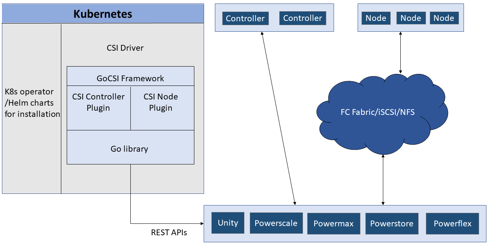

The CSI Drivers by Dell EMC implement an interface between [CSI](https://kubernetes-csi.github.io/docs/) (CSI spec v1.3) enabled Container Orchestrator (CO) and Dell EMC Storage Arrays. It is a plug-in that is installed into Kubernetes to provide persistent storage using Dell storage system.

The following are the drivers provided for the Dell storage family:

| Release/Drivers | PowerScale/Isilon | Unity | PowerStore | PowerFlex/VxFlex OS | PowerMax |
| - | :-: | :-: | :-: | :-: | :-: |
| Current | v1.6  | v1.6 | v1.4 | v1.5 | v1.7 |
| [Previous](../../v1/) | v1.5 |  v1.5 | v1.3 | v1.4 | v1.6 |
| [Older](../../v2/) | v1.4 |  v1.4 | v1.2 | v1.3 | v1.5 |
| [Archives](../archives/) | v1.3 |  v1.3 | v1.1| v1.2 | v1.4 |

## Architecture

## Features and capabilities

### Supported Platforms

|               | PowerMax         | PowerFlex |&emsp;&emsp; Unity| PowerScale/Isilon |    PowerStore    |
|---------------|:----------------:|:-------------------:|:----------------:|:-----------------:|:----------------:|
| Storage Array |5978.479.479, 5978.669.669, Unisphere 9.2|    3.5.x, 3.6.x    | 5.0.3, 5.0.4, 5.0.5, 5.0.6, 5.0.7 | OneFS 8.1, 8.2, 9.0, 9.1 | 1.0.x, 2.0.x |
| Kubernetes    | 1.19, 1.20, 1.21 |   1.19, 1.20, 1.21   |  1.19, 1.20, 1.21 |   1.19, 1.20, 1.21  | 1.19, 1.20, 1.21 |
| RHEL          |     7.x,8.x      |     7.x,8.x         |     7.x,8.x      |     7.x,8.x       |     7.x,8.x      |
| Ubuntu        |       20.04      |       20.04         |       18.04, 20.04      |        18.04, 20.04      |          20.04     |
| CentOS        |     7.8, 7.9     |      7.8, 7.9       |     7.8, 7.9     |      7.8, 7.9     |     7.8, 7.9     |
| SLES          |        no        |        15SP2        |       15SP2      |         15SP2     |       15SP2      |
| Fedora Core OS|        no        |         5.x       |        no        |         no        |        no        |
| OpenShift     | 4.6, 4.6 EUS, 4.7|       4.6, 4.6 EUS, 4.7      |    4.6, 4.6 EUS, 4.7     |   4.6, 4.6 EUS, 4.7   |  4.6, 4.6 EUS, 4.7 |
| MKE      |       3.4.0      |        3.4.0        |       3.4.0      |        3.4.0      |        3.4.0     |
| Google Anthos |        1.6       |          1.6        |        no        |         no        |        1.7       |
| VMware Tanzu  |        no        |          no         |        yes       |         yes       |       no         |
| RKE           |        no        |          yes         |        yes       |         no       |       no         |

### CSI Driver Capabilities

| Features                 | PowerMax | PowerFlex/VxFlexOS | &emsp;&emsp; Unity  | PowerScale/Isilon | PowerStore |
|--------------------------|:--------:|:------------------:|:---------:|:-----------------:|:----------:|
| Static Provisioning      | yes      | yes                | yes   | yes               | yes        |
| Dynamic Provisioning     | yes      | yes                | yes   | yes               | yes        |
| Expand Persistent Volume | yes      | yes                | yes   | yes               | yes        |
| Create VolumeSnapshot    | yes      | yes                | yes   | yes               | yes        |
| Create Volume from Snapshot | yes   | yes                | yes   | yes               | yes        |
| Delete Snapshot          | yes      | yes                | yes   | yes               | yes        |
| [Access Mode](https://kubernetes.io/docs/concepts/storage/persistent-volumes/#access-modes)         | RWO(FC/iSCSI) RWO/RWX/ROX(Raw block) | RWO RWO/RWX/ROX(Raw block) | RWO(FC/iSCSI) RWO/RWX(RawBlock) RWO/RWX/ROX(NFS) | RWO/RWX/ROX | RWO(FC/iSCSI) RWO/RWX/ROX(RawBlock, NFS) |
| CSI Volume Cloning       | yes      | yes                | yes   | yes               | yes        |
| CSI Raw Block Volume     | yes      | yes                | yes   | no                | yes        |
| CSI Ephemeral Volume     | no       | yes                | yes   | yes               | yes        |
| Topology                 | yes      | yes                | yes   | yes               | yes        |
| Multi-array              | yes  | yes  | yes | yes | yes     |

### Backend Storage Details

| Features      | PowerMax         | VxFlexOS/PowerFlex | &emsp;&emsp;Unity | Isilon/PowerScale| PowerStore       |
|---------------|:----------------:|:------------------:|:----------------:|:----------------:|:----------------:|
| Fibre Channel | yes              | N/A                | yes              | N/A              | yes              |
| iSCSI         | yes              | N/A                | yes              | N/A              | yes              |
| NFS           | N/A              | N/A                | yes              | yes              | yes              |
| Other         | N/A              | ScaleIO protocol   | N/A              | N/A              | N/A              |
| Supported FS  | ext4 / xfs       | ext4 / xfs         | ext3 / ext4 / xfs / NFS | NFS       | ext3 / ext4 / xfs / NFS       |
| Thin / Thick provisioning | yes  | yes                | yes              | N/A              | yes              |
| Platform-specific configurable settings | Service Level selection iSCSI CHAP | - | Host IO Limit Tiering Policy NFS Host IO size Snapshot Retention duration | Access Zone NFS version (3 or 4);Configurable Export IPs | iSCSI CHAP |


