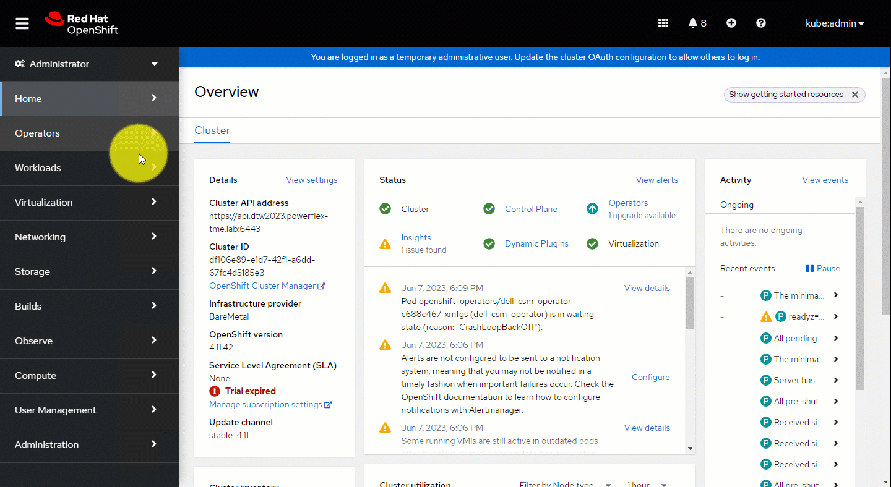

The Dell Container Storage Modules Operator is a Kubernetes Operator, which can be used to install and manage the CSI Drivers and CSM Modules provided by Dell for various storage platforms. This operator is available as a community operator for upstream Kubernetes and can be deployed using OperatorHub.io. The operator can be installed using OLM (Operator Lifecycle Manager) or manually.

## Support Matrix

Dell CSM Operator has been tested and qualified on Upstream Kubernetes and OpenShift. Supported versions are listed below:

| Kubernetes Version         | OpenShift Version   |
| -------------------------- | ------------------- |
| 1.25, 1.26, 1.27           | 4.11, 4.12, 4.12 EUS |

>NOTE:
>- Authorization module is only supported on Kubernetes platforms.

## Supported CSM Components

The table below lists the driver and modules versions installable with the CSM Operator:

| CSI Driver         | Version | CSM Authorization | CSM Replication | CSM Observability | CSM Resiliency |
| ------------------ |---------|-------------------|-----------------|-------------------|----------------|
| CSI PowerScale     | 2.7.0   | ✔ 1.7.0           | ✔ 1.5.0         | ✔ 1.5.0           | ✔ 1.6.0        |
| CSI PowerScale     | 2.6.0   | ✔ 1.6.0           | ✔ 1.4.0         | ✔ 1.5.0           | ❌              |
| CSI PowerScale     | 2.5.0   | ✔ 1.5.0           | ✔ 1.3.0         | ✔ 1.4.0           | ❌              |
| CSI PowerFlex      | 2.7.0   | ✔ 1.7.0           | ✔ 1.5.0         | ✔ 1.5.0           | ✔ 1.6.0        |
| CSI PowerFlex      | 2.6.0   | ✔ 1.6.0           | ✔ 1.4.0         | ✔ 1.5.0           | ❌              |
| CSI PowerFlex      | 2.5.0   | ✔ 1.5.0           | ❌              | ✔ 1.4.0           | ❌              |
| CSI PowerStore     | 2.7.0   | ❌                | ❌              | ❌                 | ✔ 1.6.0        |
| CSI PowerStore     | 2.6.0   | ❌                | ❌              | ❌                 | ❌              |
| CSI PowerMax       | 2.7.0   | ✔ 1.7.0           | ✔ 1.5.0         | ❌                 | ❌              |
| CSI Unity XT       | 2.7.0   | ❌                | ❌              | ❌                 | ❌              |

>NOTE:
>- Refer to sample files [here](https://github.com/dell/csm-operator/tree/main/samples).

## Installation
Dell CSM Operator can be installed manually or via Operator Hub.

Once installed you will be able to deploy [drivers](drivers) and [modules](modules) from the Operator.

### OpenShift Installation via Operator Hub
`dell-csm-operator` can be installed via Operator Hub on upstream Kubernetes clusters & Red Hat OpenShift Clusters.

The installation process involves the creation of a `Subscription` object either via the _OperatorHub_ UI or using `kubectl/oc`. While creating the `Subscription` you can set the Approval strategy for the `InstallPlan` for the operator to:
* _Automatic_ - If you want the operator to be automatically installed or upgraded (once an upgrade is available).
* _Manual_ - If you want a cluster administrator to manually review and approve the `InstallPlan` for installation/upgrades.



>NOTE: Dell CSM Operator is distributed as a `Certified` & `Community` versions. Both are the exact same code and supported by Dell Technologies, the only difference is that the `Certified` version is validated by RedHat. The `Certified` version often release couple of days/weeks after the `Community` version.

### Manual Installation on a cluster without OLM

1. Install volume snapshot CRDs. For detailed snapshot setup procedure, [click here](../../snapshots/#volume-snapshot-feature).
2. Clone and checkout the required csm-operator version using
```bash
git clone -b v1.2.0 https://github.com/dell/csm-operator.git
```
3. `cd csm-operator`
4. (Optional) If using a local Docker image, edit the `deploy/operator.yaml` file and set the image name for the CSM Operator Deployment.
5. Run `bash scripts/install.sh` to install the operator.

>NOTE: Dell CSM Operator will be installed in the `dell-csm-operator` namespace.



6. Run the command to validate the installation.
```bash
kubectl get pods -n dell-csm-operator
```
 If installed successfully, you should be able to see the operator pod in the `dell-csm-operator` namespace.



## Uninstall
### Operator uninstallation on a cluster without OLM
To uninstall a CSM operator, run `bash scripts/uninstall.sh`. This will uninstall the operator in `dell-csm-operator` namespace.



## Upgrade
### Dell CSM Operator
Dell CSM Operator can be upgraded in 2 ways:

1. Using Operator Lifecycle Manager (OLM)

2. Using script (for non-OLM based installation)

#### Using OLM
The upgrade of the Dell CSM Operator is done via Operator Lifecycle Manager.

The `Update approval` (**`InstallPlan`** in OLM terms) strategy plays a role while upgrading dell-csm-operator on OpenShift. This option can be set during installation of dell-csm-operator on OpenShift via the console and can be either set to `Manual` or `Automatic`.
- If the **`Update approval`** is set to `Automatic`, OpenShift automatically detects whenever the latest version of dell-csm-operator is available in the **`Operator hub`**, and upgrades it to the latest available version.
- If the upgrade policy is set to `Manual`, OpenShift notifies of an available upgrade. This notification can be viewed by the user in the **`Installed Operators`** section of the OpenShift console. Clicking on the hyperlink to `Approve` the installation would trigger the dell-csm-operator upgrade process.

>NOTE: The recommended version of OLM for Upstream Kubernetes is **`v0.18.3`**.

#### Using Installation Script
1. Clone and checkout the required csm-operator version using 
```bash
git clone -b v1.2.0 https://github.com/dell/csm-operator.git
```
2. `cd csm-operator`
3. Execute `bash scripts/install.sh --upgrade`  . This command will install the latest version of the operator.

>NOTE: Dell CSM Operator would install to the 'dell-csm-operator' namespace by default.

### Upgrade driver using Dell CSM Operator:
The CSI Drivers installed by the Dell CSM Operator can be updated like any Kubernetes resource.
* Modifying the installation directly via `kubectl edit`
    ```
    $ kubectl get <driver-object> -n <driver-namespace>
    ```
    For example - If the CSI PowerStore driver is installed then run this command to get the object name
    ```
    # Replace driver-namespace with the namespace where the CSI PowerStore driver is installed
    $ kubectl get csm -n <driver-namespace>
    ```
    use the object name in `kubectl edit` command.
    ```
    $ kubectl edit csm <driver-object>/<object-name> -n <driver-namespace>
    ```
    For example - If the object name is powerstore then use the name as powerstore
    ```
    # Replace object-name with the powerstore
    $ kubectl edit csm powerstore -n <driver-namespace>
    ```
    and modify the installation. The usual fields to edit are the version of drivers, sidecars and the environment variables.
The following notes explain some of the general items to take care of.

**NOTES:**
1. If you are trying to upgrade the CSI driver from an older version, make sure to modify the _configVersion_ field.
   ```yaml
      driver:
        configVersion: v2.7.0
   ```

## Custom Resource Definitions
As part of the Dell CSM Operator installation, a CRD representing configuration for the CSI Driver and CSM Modules is also installed.
`containerstoragemodule` CRD is installed in API Group `storage.dell.com`.

Drivers and modules can be installed by creating a `customResource`.

### Custom Resource Specification
Each CSI Driver and CSM Module installation is represented by a Custom Resource.

The specification for the Custom Resource is the same for all the drivers.Below is a list of all the mandatory and optional fields in the Custom Resource specification

#### Mandatory fields

**configVersion** - Configuration version - refer [here](#supported-csi-drivers) for appropriate config version.

**replicas**  - Number of replicas for controller plugin - must be set to 1 for all drivers.

**dnsPolicy** - Determines the dnsPolicy for the node daemonset. Accepted values are `Default`, `ClusterFirst`, `ClusterFirstWithHostNet`, `None`.

**common** - This field is mandatory and is used to specify common properties for both controller and the node plugin.

* image - driver container image
* imagePullPolicy - Image Pull Policy of the driver image
* envs - List of environment variables and their values

#### Optional fields

**controller** - List of environment variables and values which are applicable only for controller.

**node** - List of environment variables and values which are applicable only for node.

**sideCars** - Specification for CSI sidecar containers.

**tlsCertSecret** - Name of the TLS cert secret for use by the driver. If not specified, a secret *-certs must exist in the namespace as driver.

**tolerations** - List of tolerations which should be applied to the driver StatefulSet/Deployment and DaemonSet. It should be set separately in the controller and node sections if you want separate set of tolerations for them.

**nodeSelector** - Used to specify node selectors for the driver StatefulSet/Deployment and DaemonSet.

>NOTE: The `image` field should point to the correct image tag for version of the driver you are installing.
