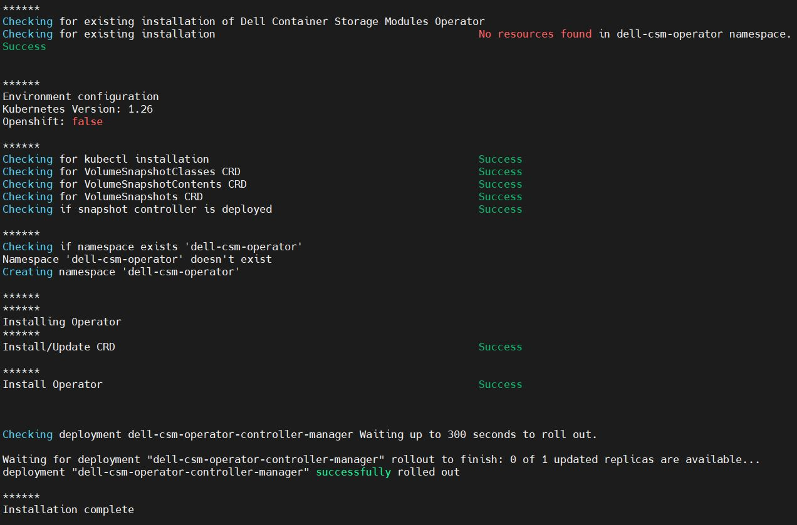
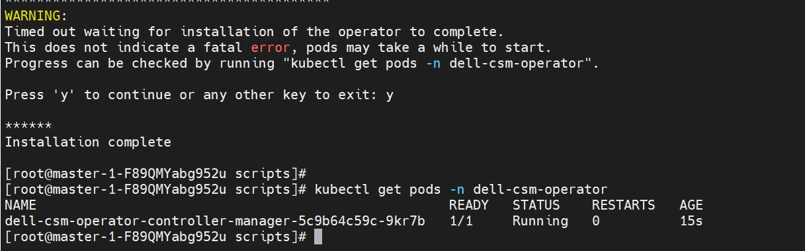

{}

{}
The Dell Container Storage Modules Operator is a Kubernetes Operator, which can be used to install and manage the CSI Drivers and CSM Modules provided by Dell for various storage platforms. This operator is available as a community operator for upstream Kubernetes and can be deployed using OperatorHub.io. The operator can be installed using OLM (Operator Lifecycle Manager) or manually.

## Supported CSM Components

The table below lists the driver and modules versions installable with the CSM Operator:

| CSI Driver         | Version | CSM Authorization 1.x.x , 2.x.x | CSM Replication | CSM Observability | CSM Resiliency |
| ------------------ |---------|---------------------------------|-----------------|-------------------|----------------|
| CSI PowerScale     | 2.12.0  | ✔ 1.12.0  , 2.0.0              | ✔ 1.10.0       | ✔ 1.10.0          | ✔ 1.11.0      |
| CSI PowerScale     | 2.11.0  | ✔ 1.11.0  , ❌             | ✔ 1.9.0        | ✔ 1.9.0           | ✔ 1.10.0      |
| CSI PowerScale     | 2.10.1  | ✔ 1.10.1  , ❌             | ✔ 1.8.1        | ✔ 1.8.1           | ✔ 1.9.1       |
| CSI PowerFlex      | 2.12.0  | ✔ 1.12.0  , 2.0.0           | ✔ 1.10.0       | ✔ 1.10.0          | ✔ 1.11.0      |
| CSI PowerFlex      | 2.11.0  | ✔ 1.11.0  , ❌             | ✔ 1.9.0        | ✔ 1.9.0           | ✔ 1.10.0      |
| CSI PowerFlex      | 2.10.1  | ✔ 1.10.1  , ❌             | ✔ 1.8.1        | ✔ 1.8.1           | ✔ 1.9.1       |
| CSI PowerStore     | 2.12.0  | ❌ , ❌                    | ❌             | ❌                | ✔ 1.11.0      |
| CSI PowerStore     | 2.11.1  | ❌ , ❌                    | ❌             | ❌                | ✔ 1.10.0      |
| CSI PowerStore     | 2.10.1  | ❌ , ❌                    | ❌             | ❌                | ✔ 1.9.1       |
| CSI PowerMax       | 2.12.0  | ✔ 1.12.0  , 2.0.0           | ✔ 1.10.0       | ✔ 1.10.0          | ✔ 1.11.0      |
| CSI PowerMax       | 2.11.0  | ✔ 1.11.0  , ❌             | ✔ 1.9.0        | ✔ 1.9.0           | ✔ 1.10.0      |
| CSI PowerMax       | 2.10.1  | ✔ 1.10.1  , ❌             | ✔ 1.8.1        | ✔ 1.8.1           | ❌            |
| CSI Unity XT       | 2.12.0  | ❌ , ❌                    | ❌             | ❌                | ❌            |
| CSI Unity XT       | 2.11.1  | ❌ , ❌                    | ❌             | ❌                | ❌            |
| CSI Unity XT       | 2.10.1  | ❌ , ❌                    | ❌             | ❌                | ❌            |

These CR will be used for new deployment or upgrade. In most case, it is recommended to use the latest available version.

The full compatibility matrix of CSI/CSM versions for the CSM Operator is available [here](../../prerequisites/#csm-operator-compatibility-matrix)

## Installation

Before installing the driver, you need to install the operator. You can find the installation instructions here.

### Manual Installation on a cluster without OLM
>NOTE: You can update the resource requests and limits when you are deploying operator using manual installation without OLM

1. Install volume snapshot CRDs. For detailed snapshot setup procedure, [click here](../../snapshots/#volume-snapshot-feature).
2. Clone and checkout the required csm-operator version using
```bash
git clone -b v1.7.0 https://github.com/dell/csm-operator.git
```
3. `cd csm-operator`
4. _(Optional)_ If using a local Docker image, edit the `deploy/operator.yaml` file and set the image name for the CSM Operator Deployment.
5. _(Optional)_ The Dell CSM Operator might need more resources if users have larger environment (>1000 Pods). You can modify the default resource requests and limits in the files `deploy/operator.yaml`, `config/manager/manager.yaml`  and increase the values for cpu and memory. More information on setting the resource requests and limits can be found [here](https://sdk.operatorframework.io/docs/best-practices/managing-resources/). Current default values are set as below:
    ```yaml
        resources:
          limits:
            cpu: 200m
            memory: 512Mi
          requests:
            cpu: 100m
            memory: 192Mi
    ```
6. _(Optional)_ If **CSM Replication** is planned for use and will be deployed using two clusters in an environment where the DNS is not configured, and cluster API endpoints are FQDNs, in order to resolve queries to remote API endpoints, it is necessary to edit the `deploy/operator.yaml` file and add the `hostAliases` field and associated `<FQDN>:<IP>` mappings to the CSM Operator Controller Manager Deployment under `spec.template.spec`. More information on host aliases can be found, [here](https://kubernetes.io/docs/tasks/network/customize-hosts-file-for-pods/).
    ```yaml
    # example config
    apiVersion: apps/v1
    kind: Deployment
    metadata:
      name: dell-csm-operator-controller-manager
    spec:
      template:
        spec:
          hostAliases:
          - hostnames:
            - "remote.FQDN"
            ip: "255.255.255.1"
    ```
7. Run `bash scripts/install.sh` to install the operator.

>NOTE: Dell CSM Operator will be installed in the `dell-csm-operator` namespace.

>NOTE: If you want to update the resource requests and limits configuration after the operator is installed. Follow the steps below:

     * Uninstall the operator following the steps [here](https://dell.github.io/csm-docs/v3/deployment/csmoperator/#uninstall)

     * Update the resource configuration as mentioned in step 5 and install the operator using the step 7 above



8. Run the command to validate the installation.
```bash
kubectl get pods -n dell-csm-operator
```
 If installed successfully, you should be able to see the operator pod in the `dell-csm-operator` namespace.

