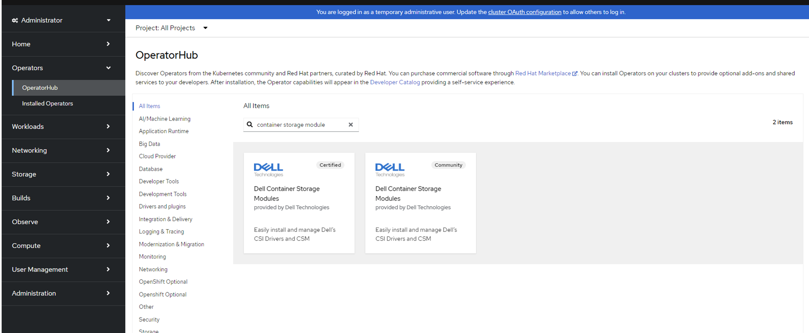
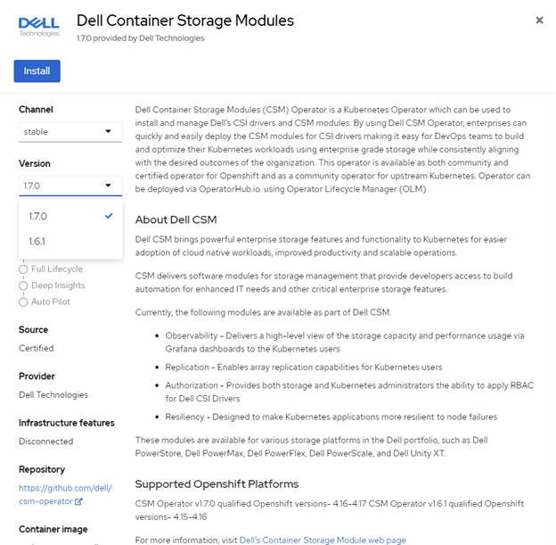
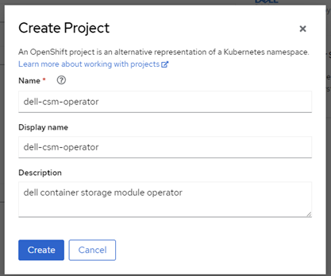
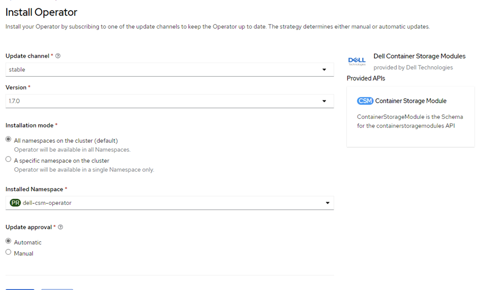
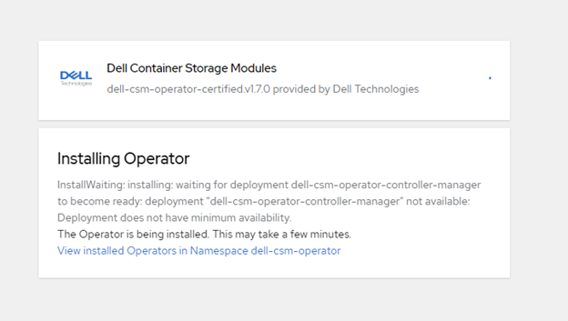
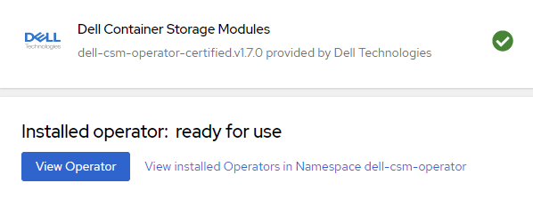
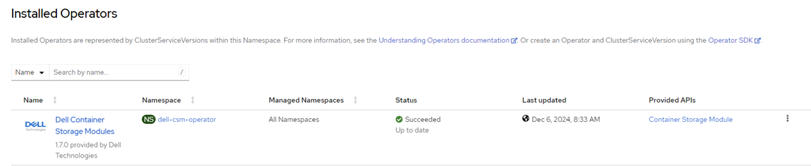

{}

{}
The Container Storage Modules Operator is a Kubernetes Operator, which can be used to install and manage the CSI Drivers and Container Storage Modules provided for various Dell storage platforms. This operator is available as a community operator for upstream Kubernetes and can be deployed using OperatorHub.io. The operator can be installed using OLM (Operator Lifecycle Manager) or manually.

## Supported CSM Components
For the supported version [here](../../../supportmatrix/#operator-compatibility-matrix).

These CR will be used for new deployment or upgrade. In most case, it is recommended to use the latest available version.

## Installation

Before installing the driver, you need to install the operator. You can find the installation instructions here.

### OpenShift Installation via Operator Hub
<!--
>NOTE: You can update the resource requests and limits when you are deploying operator using Operator Hub

`dell-csm-operator` can be installed via Operator Hub on upstream Kubernetes clusters & Red Hat OpenShift Clusters.

The installation process involves the creation of a `Subscription` object either via the _OperatorHub_ UI or using `kubectl/oc`. While creating the `Subscription` you can set the Approval strategy for the `InstallPlan` for the operator to:

* _Automatic_ - If you want the operator to be automatically installed or upgraded (once an upgrade is available).
* _Manual_ - If you want a cluster administrator to manually review and approve the `InstallPlan` for installation/upgrades.

 
--> 
>NOTE: You can update the resource requests and limits when you are deploying operator using Operator Hub

1. From your OpenShift UI, select **OperatorHub** in the left pane.

2. On the **OperatorHub page**, search for `container storage module` and select its card.

     

3. Choose the right operator `version` and click Install.

      

   Its starts installing the `container storage module` operator and directs you to the **Install Operator** page.

   In the **Installation mode** section:
   - Select `A specific namespace on the cluster`.
   - Click **Create Project** from the `Installed Namespace` dropdown.

4. In the **Create Project** window, name it `dell-csm-operator`, enter the `display name` and `description`, then click **Create** to create the namespace `dell-csm-operator`.

     

   To install an operator, you need to create a Subscription object. You can do this using either the OperatorHub UI or kubectl/oc commands. During this process, you can set the Approval strategy for the InstallPlan 

   * **Automatic** - If you want the operator to be automatically installed or upgraded (once an upgrade is available).

   * **Manual** - If you want a cluster administrator to manually review and approve the InstallPlan for installation/upgrades.  

      

5. Click **Install** to deploy `container storage module Operator` in the `dell-csm-operator` namespace.  

     

    

6. Once the operator is installed it will be displayed under the **Installed Operators**.
   
   

### Certified vs Community

Container Storage Module Operator is distributed as both `Certified` & `Community` editions.

Both editions have the same codebase and are supported by Dell Technologies, the only differences are:

* The `Certified` version is officially supported by Redhat by partnering with software vendors.
* The `Certified` version is often released couple of days/weeks after the `Community` version.
* The `Certified` version is specific to Openshift and can only be installed on specific Openshift versions where it is certified.
* The `Community` can be installed on any Kubernetes distributions.
