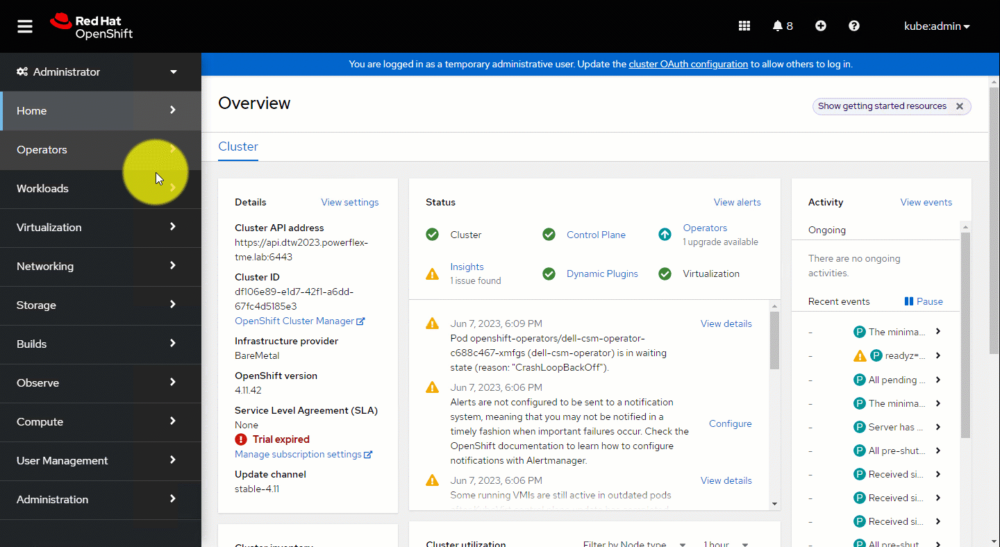

{}

{}
The Dell Container Storage Modules Operator is a Kubernetes Operator, which can be used to install and manage the CSI Drivers and CSM Modules provided by Dell for various storage platforms. This operator is available as a community operator for upstream Kubernetes and can be deployed using OperatorHub.io. The operator can be installed using OLM (Operator Lifecycle Manager) or manually.

## Supported CSM Components

The table below lists the driver and modules versions installable with the CSM Operator:

| CSI Driver         | Version | CSM Authorization 1.x.x , 2.x.x | CSM Replication | CSM Observability | CSM Resiliency |
| ------------------ |---------|---------------------------------|-----------------|-------------------|----------------|
| CSI PowerScale     | 2.12.0  | ✔ 1.12.0  , 2.0.0              | ✔ 1.10.0       | ✔ 1.10.0          | ✔ 1.11.0      |
| CSI PowerScale     | 2.11.0  | ✔ 1.11.0  , ❌             | ✔ 1.9.0        | ✔ 1.9.0           | ✔ 1.10.0      |
| CSI PowerScale     | 2.10.1  | ✔ 1.10.1  , ❌             | ✔ 1.8.1        | ✔ 1.8.1           | ✔ 1.9.1       |
| CSI PowerFlex      | 2.12.0  | ✔ 1.12.0  , 2.0.0           | ✔ 1.10.0       | ✔ 1.10.0          | ✔ 1.11.0      |
| CSI PowerFlex      | 2.11.0  | ✔ 1.11.0  , ❌             | ✔ 1.9.0        | ✔ 1.9.0           | ✔ 1.10.0      |
| CSI PowerFlex      | 2.10.1  | ✔ 1.10.1  , ❌             | ✔ 1.8.1        | ✔ 1.8.1           | ✔ 1.9.1       |
| CSI PowerStore     | 2.12.0  | ❌ , ❌                    | ❌             | ❌                | ✔ 1.11.0      |
| CSI PowerStore     | 2.11.1  | ❌ , ❌                    | ❌             | ❌                | ✔ 1.10.0      |
| CSI PowerStore     | 2.10.1  | ❌ , ❌                    | ❌             | ❌                | ✔ 1.9.1       |
| CSI PowerMax       | 2.12.0  | ✔ 1.12.0  , 2.0.0           | ✔ 1.10.0       | ✔ 1.10.0          | ✔ 1.11.0      |
| CSI PowerMax       | 2.11.0  | ✔ 1.11.0  , ❌             | ✔ 1.9.0        | ✔ 1.9.0           | ✔ 1.10.0      |
| CSI PowerMax       | 2.10.1  | ✔ 1.10.1  , ❌             | ✔ 1.8.1        | ✔ 1.8.1           | ❌            |
| CSI Unity XT       | 2.12.0  | ❌ , ❌                    | ❌             | ❌                | ❌            |
| CSI Unity XT       | 2.11.1  | ❌ , ❌                    | ❌             | ❌                | ❌            |
| CSI Unity XT       | 2.10.1  | ❌ , ❌                    | ❌             | ❌                | ❌            |

These CR will be used for new deployment or upgrade. In most case, it is recommended to use the latest available version.

The full compatibility matrix of CSI/CSM versions for the CSM Operator is available [here](../../prerequisites/#csm-operator-compatibility-matrix)

## Installation

Before installing the driver, you need to install the operator. You can find the installation instructions here.

### OpenShift Installation via Operator Hub
<!--
>NOTE: You can update the resource requests and limits when you are deploying operator using Operator Hub

`dell-csm-operator` can be installed via Operator Hub on upstream Kubernetes clusters & Red Hat OpenShift Clusters.

The installation process involves the creation of a `Subscription` object either via the _OperatorHub_ UI or using `kubectl/oc`. While creating the `Subscription` you can set the Approval strategy for the `InstallPlan` for the operator to:

* _Automatic_ - If you want the operator to be automatically installed or upgraded (once an upgrade is available).
* _Manual_ - If you want a cluster administrator to manually review and approve the `InstallPlan` for installation/upgrades.

 
--> 
>NOTE: You can update the resource requests and limits when you are deploying operator using Operator Hub

1. From your OpenShift UI, select **OperatorHub** in the left pane. 

2. On the **OperatorHub** page, search for “container storage module” and select the **container storage module** card: 

    

3. Select the **appropriate** operator version and click on **install**.

     

   **Contained storage module** Operator begins to install and takes you to the **Install Operator** page.  

   On this page: 
    * Select the **A specific namespace on the cluster** option for **Installation mode**. 
    * Choose the **Create Project** option from the **Installed Namespace** dropdown. 

4. In the **Create Project window**, provide the name dell-csm-operator and click **Create** to create a namespace called **“dell-csm-operator”**. 

    

   * To install an operator, you need to create a Subscription object. You can do this using either the OperatorHub UI or kubectl/oc commands. During this process, you can set the Approval strategy for the InstallPlan 

   * **Automatic** - If you want the operator to be automatically installed or upgraded (once an upgrade is available). 

   * **Manual** - If you want a cluster administrator to manually review and approve the InstallPlan for installation/upgrades.  

     

5. Click **Install** to deploy container storage module Operator in the dell-csm-operator namespace.  

   

      

6. Once the operator is installed it will be displayed under the **“Installed Operators”**. 
   
   

### Certified vs Community

Dell CSM Operator is distributed as both `Certified` & `Community` editions.

Both editions have the same codebase and are supported by Dell Technologies, the only differences are:

* The `Certified` version is officially supported by Redhat by partnering with software vendors.
* The `Certified` version is often released couple of days/weeks after the `Community` version.
* The `Certified` version is specific to Openshift and can only be installed on specific Openshift versions where it is certified.
* The `Community` can be installed on any Kubernetes distributions.
