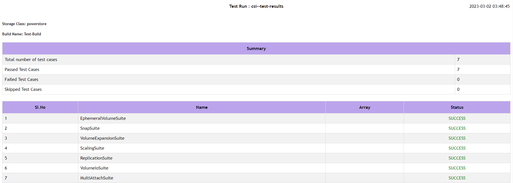

Dell's Cert-CSI is a tool to validate Dell CSI Drivers. It contains various test suites to validate the drivers and addresses the complexity involved with certifiying Dell CSI drivers in different customer environments.

Any orchestrator platform, operating system or version that is not mentioned in the support matrix but self-certified by the customer using cert-csi is supported for customer use.

## Qualify and Submit Test Results

You may qualify your environment for Dell CSI Drivers by executing the [Run All Test Suites](#run-all-test-suites) workflow.

Please submit your test results for our review [here](https://github.com/dell/csm/issues/new?assignees=&labels=type%2Fqualification&projects=&template=community_qualification.yml&title=%5BQualification%5D%3A+). If the results are a success, the orchestrator platform and version will be published under Community Qualified Configurations.

## Installation

There are three methods of installing `cert-csi`.

1. [Download the executable from the latest GitHub release](#download-release-linux).
2. [Pull the container image from quay.io](#pull-the-container-image).
3. [Build the executable or container image locally](#building-locally).

> The executable from the GitHub Release only supports Linux. For non-Linux users, you must build the `cert-csi` executable [locally](#building-locally).

### Download Release (Linux)
> NOTE: Please ensure you delete any previously downloaded Cert-CSI binaries, as each release uses the same name (`cert-csi-linux-amd64`). After installing the latest version, run the `cert-csi -v` command to verify the installed version.

1. Download `cert-csi` from [here](https://github.com/dell/cert-csi/releases/latest/download/cert-csi-linux-amd64)

2. Set the execute permission before running it.

``` bash
chmod +x ./cert-csi-linux-amd64
```

3. Install cert-csi-linux-amd64 as cert-csi.

```bash
sudo install -o root -g root -m 0755 cert-csi-linux-amd64 /usr/local/bin/cert-csi
```

If you do not have root access on the target system, you can still install cert-csi to the ~/.local/bin directory:

```bash
chmod +x ./cert-csi-linux-amd64
mkdir -p ~/.local/bin
mv ./cert-csi-linux-amd64 ~/.local/bin/cert-csi
# and then append (or prepend) ~/.local/bin to $PATH
```

### Pull The Container Image

   
   
      docker pull quay.io/dell/container-storage-modules/cert-csi:v1.6.0

   
   

      podman pull quay.io/dell/container-storage-modules/cert-csi:v1.6.0

   
   

### Building Locally
#### Prerequisites
- [Git](https://git-scm.com/book/en/v2/Getting-Started-Installing-Git)
- [Go](https://go.dev/doc/install) (If building the executable)
- Podman or Docker (If building the container image)

1. Clone the repository

```bash
git clone -b "v1.6.0" https://github.com/dell/cert-csi.git && cd cert-csi
```

2. Build cert-csi




   make build          # the cert-csi executable will be in the working directory
   chmod +x ./cert-csi # if building on *nix machine




  # uses podman if available, otherwise uses docker. The resulting image is tagged cert-csi:latest
  make docker




### Optional

If you want to collect csi-driver resource usage metrics, then please provide the namespace where it can be found and install the metric-server using this command (kubectl is required):

```bash
make install-ms
```

## Running Cert-CSI



   cert-csi --help


   docker run --rm -it -v ~/.kube/config:/root/.kube/config quay.io/dell/container-storage-modules/cert-csi:v1.6.0 --help


   podman run --rm -it -v ~/.kube/config:/root/.kube/config quay.io/dell/container-storage-modules/cert-csi:v1.6.0 --help




> The following sections showing how to execute the various test suites use the executable for brevity. For executions requiring special behavior, such as mounting file arguments into the container image, it will be noted for the relevant command.

> Log files are located in the `logs` directory in the working directory of cert-csi.\
> Report files are located in the default `$HOME/.cert-csi/reports` directory.\
> Database (SQLite) file for test suites is `<storage-class-name>.db` in the working directory of cert-csi.\
> Database (SQLite) file for functional test suites is `cert-csi-functional.db` in the working directory of cert-csi.

> NOTE: If using the container image, these files will be inside the container. If you are interested in these files, it is recommended to use the executable.

## Run All Test Suites

You can use cert-csi to launch a test run against multiple storage classes to check if the driver adheres to advertised capabilities.

#### Preparing Config

To run the test suites you need to provide `.yaml` config with storage classes and their capabilities. You can use `example-certify-config.yaml` as an example.

Template:
```yaml
storageClasses:
  - name: # storage-class-name (ex. powerstore)
    minSize: # minimal size for your sc (ex. 1Gi)
    rawBlock: # is Raw Block supported (true or false)
    expansion: # is volume expansion supported (true or false)
    clone: # is volume cloning supported (true or false)
    snapshot: # is volume snapshotting supported (true or false)
    RWX: # is ReadWriteMany volume access mode supported for non RawBlock volumes (true or false)
    volumeHealth: # set this to enable the execution of the VolumeHealthMetricsSuite (true or false)
    # Make sure to enable healthMonitor for the driver's controller and node pods before running this suite. It is recommended to use a smaller interval time for this sidecar and pass the required arguments.
    VGS: # set this to enable the execution of the VolumeGroupSnapSuite (true or false)
    # Additionally, make sure to provide the necessary required arguments such as volumeSnapshotClass, vgs-volume-label, and any others as needed.
    RWOP: # set this to enable the execution of the MultiAttachSuite with the AccessMode set to ReadWriteOncePod (true or false)
    ephemeral: # if exists, then run EphemeralVolumeSuite. See the Ephemeral Volumes suite section for example Volume Attributes
      driver: # driver name for EphemeralVolumeSuite (e.g., csi-vxflexos.dellemc.com)
      fstype: # fstype for EphemeralVolumeSuite
      volumeAttributes: # volume attrs for EphemeralVolumeSuite.
        attr1: # volume attr for EphemeralVolumeSuite
        attr2: # volume attr for EphemeralVolumeSuite
    capacityTracking: # capacityTracking test requires the storage class to have volume binding mode as 'WaitForFirstConsumer'
      driverNamespace: # namespace where driver is installed
      pollInterval:    # duration to poll capacity (e.g., 2m)
```

Driver specific examples:

   
   

storageClasses:
  - name: vxflexos
    minSize: 8Gi
    rawBlock: true
    expansion: true
    clone: true
    snapshot: true
    RWX: false
    ephemeral:
      driver: csi-vxflexos.dellemc.com
      fstype: ext4
      volumeAttributes:
        volumeName: "my-ephemeral-vol"
        size: "8Gi"
        storagepool: "sample"
        systemID: "sample"
  - name: vxflexos-nfs
    minSize: 8Gi
    rawBlock: false
    expansion: true
    clone: true
    snapshot: true
    RWX: true
    RWOP: false
    ephemeral:
      driver: csi-vxflexos.dellemc.com
      fstype: "nfs"
      volumeAttributes:
        volumeName: "my-ephemeral-vol"
        size: "8Gi"
        storagepool: "sample"
        systemID: "sample"
    capacityTracking:
      driverNamespace: vxflexos
      pollInterval: 2m


   
   

storageClasses:
  - name: isilon
    minSize: 8Gi
    rawBlock: false
    expansion: true
    clone: true
    snapshot: true
    RWX: true
    ephemeral:
      driver: csi-isilon.dellemc.com
      fstype: nfs
      volumeAttributes:
        size: "10Gi"
        ClusterName: "sample"
        AccessZone: "sample"
        IsiPath: "/ifs/data/sample"
        IsiVolumePathPermissions: "0777"
        AzServiceIP: "192.168.2.1"
    capacityTracking:
      driverNamespace: isilon
      pollInterval: 2m
   
   

storageClasses:
  - name: powermax-iscsi
    minSize: 5Gi
    rawBlock: true
    expansion: true
    clone: true
    snapshot: true
    capacityTracking:
      driverNamespace: powermax
      pollInterval: 2m
  - name: powermax-nfs
    minSize: 5Gi
    rawBlock: false
    expansion: true
    clone: false
    snapshot: false
    RWX: true
    RWOP: false
    capacityTracking:
      driverNamespace: powermax
      pollInterval: 2m

   
   

storageClasses:
  - name: powerstore
    minSize: 5Gi
    rawBlock: true
    expansion: true
    clone: true
    snapshot: true
    RWX: false
    ephemeral:
      driver: csi-powerstore.dellemc.com
      fstype: ext4
      volumeAttributes:
        arrayID: "arrayid"
        protocol: iSCSI
        size: 5Gi
  - name: powerstore-nfs
    minSize: 5Gi
    rawBlock: false
    expansion: true
    clone: true
    snapshot: true
    RWX: true
    RWOP: false
    ephemeral:
      driver: csi-powerstore.dellemc.com
      fstype: "nfs"
      volumeAttributes:
        arrayID: "arrayid"
        protocol: NFS
        size: 5Gi
        nasName: "nas-server"
    capacityTracking:
      driverNamespace: powerstore
      pollInterval: 2m

   
   

storageClasses:
  - name: unity-iscsi
    minSize: 3Gi
    rawBlock: true
    expansion: true
    clone: true
    snapshot: true
    RWX: false
    ephemeral:
      driver: csi-unity.dellemc.com
      fstype: ext4
      volumeAttributes:
        arrayId: "array-id"
        storagePool: pool-name
        protocol: iSCSI
        size: 5Gi
  - name: unity-nfs
    minSize: 3Gi
    rawBlock: false
    expansion: true
    clone: true
    snapshot: true
    RWX: true
    RWOP: false
    ephemeral:
      driver: csi-unity.dellemc.com
      fstype: "nfs"
      volumeAttributes:
        arrayId: "array-id"
        storagePool: pool-name
        protocol: NFS
        size: 5Gi
        nasServer: "nas-server"
        nasName: "nas-name"
    capacityTracking:
      driverNamespace: unity
      pollInterval: 2m

   
   

#### Launching Test Run
1. Executes the [VolumeIO](#volume-io) suite.
2. Executes the [Scaling](#scalability) suite.
3. If `storageClasses.clone` is `true`, executes the [Volume Cloning](#volume-cloning) suite.
4. If `storageClasses.expansion` is `true`, executes the [Volume Expansion](#volume-expansion) suite.
5. If `storageClasses.expansion` is `true` and `storageClasses.rawBlock` is `true`, executes the [Volume Expansion](#volume-expansion) suite with raw block volumes.
6. If `storageClasses.snapshot` is `true`, executes the [Snapshot](#snapshots) suite and the [Replication](#replication) suite.
7. If `storageClasses.rawBlock` is `true`, executes the [Multi-Attach Volume](#multi-attach-volume) suite with raw block volumes.
8. If `storageClasses.rwx` is `true`, executes the [Multi-Attach Volume](#multi-attach-volume) suite. (Storgae Class must be NFS.)
9. If `storageClasses.volumeHealth` is `true`, executes the [Volume Health Metrics](#volume-health-metrics) suite.
10. If `storageClasses.rwop` is `true`, executes the [Multi-Attach Volume](#multi-attach-volume) suite with the volume access mode `ReadWriteOncePod`.
11. If `storageClasses.ephemeral` exists, executes the [Ephemeral Volumes](#ephemeral-volumes) suite.
12. If `storageClasses.vgs` is `true`, executes the [Volume Group Snapshot]() suite.
13. If `storageClasses.capacityTracking` exists, executes the [Storage Class Capacity Tracking](#storage-capacity-tracking) suite.

> NOTE: For testing/debugging purposes, it can be useful to use the `--no-cleanup` so resources do not get deleted.

> NOTE: If you are using CSI PowerScale with [SmartQuotas](../../csidriver/features/powerscale/#usage-of-smartquotas-to-limit-storage-consumption) disabled, the `Volume Expansion` suite is expected to timeout due to the way PowerScale provisions storage. Set `storageClasses.expansion` to `false` to skip this suite.

```bash
cert-csi certify --cert-config <path-to-config> --vsc <volume-snapshot-class>
```

Withhold the `--vsc` argument if Snapshot capabilities are disabled.

```bash
cert-csi certify --cert-config <path-to-config>
Optional Params:
   --vsc: volume snapshot class, required if you specified snapshot capability
```

Run `cert-csi certify -h` for more options.

If you are using the container image, the `cert-config` file must be mounted into the container. Assuming your `cert-config` file is `/home/user/example-certify-config.yaml`, here are examples of how to execute this suite with the container image.



   docker run --rm -it -v ~/.kube/config:/root/.kube/config -v /home/user/example-certify-config.yaml:/example-certify-config.yaml quay.io/dell/container-storage-modules/cert-csi:v1.6.0 certify --cert-config /example-certify-config.yaml --vsc <volume-snapshot-class>


   podman run --rm -it -v ~/.kube/config:/root/.kube/config -v /home/user/example-certify-config.yaml:/example-certify-config.yaml quay.io/dell/container-storage-modules/cert-csi:v1.6.0 certify --cert-config /example-certify-config.yaml --vsc <volume-snapshot-class>



## Running Individual Test Suites

> NOTE: For testing/debugging purposes, it can useful to use the `--no-cleanup` flag so resources do not get deleted.

#### Volume I/O
1. Creates the namespace `volumeio-test-*` where resources will be created.
2. Creates Persistent Volume Claims.
3. If the specified storage class binding mode is not `WaitForFirstConsumer`, waits for Persistent Volume Claims to be bound to Persistent Volumes.
4. For each Persistent Volume Claim, executes the following workflow concurrently:
   1. Creates a Pod to consume the Persistent Volume Claim.
   2. Writes data to the volume and verifies the checksum of the data.
   3. Deletes the Pod.
   4. Waits for the associated Volume Attachment to be deleted.

```bash
cert-csi test vio --sc <storage class>
```

Run `cert-csi test vio -h` for more options.

#### Scalability
1. Creates the namespace `scale-test-*` where resources will be created.
2. Creates a StatefulSet.
3. Scales up the StatefulSet.
4. Scales down the StatefulSet to zero.

```bash
cert-csi test scaling --sc <storage class>
```

Run `cert-csi test scaling -h` for more options.

#### Snapshots
1. Creates the namespace `snap-test-*` where resources will be created.
2. Creates Persistent Volume Claim.
3. If the specified storage class binding mode is not `WaitForFirstConsumer`, waits for Persistent Volume Claim to be bound to Persistent Volumes.
4. Create Pod to consume the Persistent Volume Claim.
5. Writes data to the volume.
6. Deletes the Pod.
7. Creates a Volume Snapshot from the Persistent Volume Claim.
8. Waits for the Volume Snapshot to be Ready.
9. Creates a new Persistent Volume Claim from the Volume Snapshot.
10. Creates a new Pod to consume the new Persistent Volume Claim.
11. Verifies the checksum of the data.

```bash
cert-csi test snap --sc <storage class> --vsc <volume snapshot class>
```

Run `cert-csi test snap -h` for more options.

#### Volume Group Snapshots
1. Creates the namespace `vgs-snap-test-*` where resources will be created.
2. Creates Persistent Volume Claims.
3. If the specified storage class binding mode is not `WaitForFirstConsumer`, waits for Persistent Volume Claim to be bound to Persistent Volumes.
4. Create Pods to consume the Persistent Volume Claims.
5. Creates Volume Group Snapshot.
6. Waits for Volume Group Snapshot state to be COMPLETE.

> Note: Volume Group Snapshots are only supported by CSI PowerFlex and CSI PowerStore.

#### Multi-Attach Volume
1. Creates the namespace `mas-test-*` where resources will be created.
2. Creates Persistent Volume Claim.
3. Creates Pod to consume the Persistent Volume Claim.
4. Waits for Pod to be in the Ready state.
5. Creates additional Pods to consume the same Persistent Volume Claim.
6. Watis for Pods to be in the Ready state.
7. Writes data to the volumes on the Pods and verifies checksum of the data.

```bash
cert-csi test multi-attach-vol --sc <storage class>
```

> The storage class must be an NFS storage class. Otherwise, raw block volumes must be used.

```bash
cert-csi test multi-attach-vol --sc <storage class> --block
```

Run `cert-csi test multi-attach-vol -h` for more options.

#### Replication
1. Creates the namespace `replication-suite-*` where resources will be created.
2. Creates Persistent Volume Claims.
3. Create Pods to consume the Persistent Volume Claims.
4. Waits for Pods to be in the Ready state.
5. Creates a Volume Snapshot from each Persistent Volume Claim.
6. Waits for the Volume Snapshots to be Ready.
7. Creates Persistent Volume Claims from the Volume Snapshots.
8. Creates Pods to consume the Persistent Volume Claims.
9. Waits for Pods to be in the Ready state.
10. Verifies the replication group name on ersistent Volume Claims.

```bash
cert-csi test replication --sc <storage class> --vsc <snapshot class>
```

Run `cert-csi test replication -h` for more options.

#### Volume Cloning
1. Creates the namespace `clonevolume-suite-*` where resources will be created.
2. Creates Persistent Volume Claims.
3. Create Pods to consume the Persistent Volume Claims.
4. Waits for Pods to be in the Ready state.
5. Creates Persistent Volume Claims with the source volume being from the volumes in step 2.
6. Create Pods to consume the Persistent Volume Claims.
7. Waits for Pods to be in the Ready state.

```bash
cert-csi test clone-volume --sc <storage class>
```

Run `cert-csi test clone-volume -h` for more options.

#### Volume Expansion
1. Creates the namespace `volume-expansion-suite-*` where resources will be created.
2. Creates Persistent Volume Claims.
3. Create Pods to consume the Persistent Volume Claims.
4. Waits for Pods to be in the Ready state.
5. Expands the size in the Persistent Volume Claims.
6. Verifies that the volumes mounted to the Pods were expanded.

> Raw block volumes cannot be verified since there is no filesystem.

> If you are using CSI PowerScale with [SmartQuotas](../../csidriver/features/powerscale/#usage-of-smartquotas-to-limit-storage-consumption) disabled, the `Volume Expansion` suite is expected to timeout due to the way PowerScale provisions storage.

```bash
cert-csi test expansion --sc <storage class>
```

Run `cert-csi test expansion -h` for more options.

#### Blocksnap suite
1. Creates the namespace `block-snap-test-*` where resources will be created.
2. Creates Persistent Volume Claim.
3. If the specified storage class binding mode is not `WaitForFirstConsumer`, waits for Persistent Volume Claim to be bound to Persistent Volumes.
4. Creates Pod to consume the Persistent Volume Claim.
5. Writes data to the volume.
5. Creates a Volume Snapshot from the Persistent Volume Claim.
6. Waits for the Volume Snapshot to be Ready.
7. Create a Persistent Volume Claim with raw block volume mode from the Volume Snapshot.
8. Creates Pod to consume the Persistent Volume Claim.
9. Mounts the raw block volume and verifies the checksum of the data.

```bash
cert-csi test blocksnap --sc <storageClass> --vsc <snapshotclass>
```

Run `cert-csi test blocksnap -h` for more options.

#### Volume Health Metrics
1. Creates the namespace `volume-health-metrics-*` where resources will be created.
2. Creates Persistent Volume Claim.
3. Creates Pod to consume the Persistent Volume Claim.
4. Waits for Pod to be in the Ready state.
4. Veries that ControllerGetVolume and NodeGetVolumeStats are being executed in the controller and node pods, respectively.

```bash
cert-csi test volumehealthmetrics --sc <storage-class> --driver-ns <driver-namespace>
```

Run `cert-csi test volumehealthmetrics -h` for more options.

> Note: Make sure to enable healthMonitor for the driver's controller and node pods before running this suite. It is recommended to use a smaller interval time for this sidecar.

#### Ephemeral Volumes
1. Creates namespace `functional-test` where resources will be created.
2. Creates Pods with one ephemeral inline volume each.
3. Waits for Pods to be in the Ready state.
4. Writes data to the volume on each Pod.
5. Verifies the checksum of the data.

```bash
cert-csi test ephemeral-volume --driver <driver-name> --attr ephemeral-config.properties
```

Run `cert-csi test ephemeral-volume -h` for more options.

> `--driver` is the name of a CSI Driver from the output of `kubectl get csidriver` (e.g, csi-vxflexos.dellemc.com).
> This suite does not delete resources on success.

If you are using the container image, the `attr` file must be mounted into the container. Assuming your `attr` file is `/home/user/ephemeral-config.properties`, here are examples of how to execute this suite with the container image.



   docker run --rm -it -v ~/.kube/config:/root/.kube/config -v /home/user/ephemeral-config.properties:/ephemeral-config.properties quay.io/dell/container-storage-modules/cert-csi:v1.6.0 test ephemeral-volume --driver <driver-name> --attr /ephemeral-config.properties


   podman run --rm -it -v ~/.kube/config:/root/.kube/config -v /home/user/ephemeral-config.properties:/ephemeral-config.properties quay.io/dell/container-storage-modules/cert-csi:v1.6.0 test ephemeral-volume --driver <driver-name> --attr /ephemeral-config.properties




Sample ephemeral-config.properties (key/value pair)
   
   

   volumeName=my-ephemeral-vol
   size=10Gi
   storagepool=sample
   systemID=sample

   
   

   size=10Gi
   ClusterName=sample
   AccessZone=sample
   IsiPath=/ifs/data/sample
   IsiVolumePathPermissions=0777
   AzServiceIP=192.168.2.1

   
   

   size=10Gi
   arrayID=sample
   nasName=sample
   nfsAcls=0777

   
   

   size=10Gi
   arrayId=sample
   protocol=iSCSI
   thinProvisioned=true
   isDataReductionEnabled=false
   tieringPolicy=1
   storagePool=pool_2
   nasName=sample

   
   

#### Storage Capacity Tracking
1. Creates namespace `functional-test` where resources will be created.
2. Creates a duplicate of the provided storage class using prefix `capacity-tracking`.
3. Waits for the associated CSIStorageCapacity object to be created.
4. Deletes the duplicate storage class.
5. Waits for the associated CSIStorageCapacity to be deleted.
6. Sets the capacity of the CSIStorageCapacity of the provided storage class to zero.
7. Creates Pod with a volume using the provided storage class.
8. Verifies that the Pod is in the Pending state.
9. Waits for storage capacity to be polled by the driver.
10. Waits for Pod to be Running.

> Storage class must use volume binding mode `WaitForFirstConsumer`.\
> This suite does not delete resources on success.

```bash
cert-csi functional-test capacity-tracking --sc <storage-class> --drns <driver-namespace>
```

Run `cert-csi test capacity-tracking -h` for more options.

### Running Longevity mode

```bash
cert-csi test <suite-name> --sc <storage class> --longevity <number of iterations>
```
### Use configurable container images

To use custom images for creating containers pass an image config YAML file as an argument. The YAML file should have linux(test) and postgres images name with their corresponding image URL. For example

Example:
```yaml
images:
  - test: "docker.io/centos:centos7" # change this to your url
    postgres: "docker.io/bitnami/postgresql:11.8.0-debian-10-r72" # change this to your url
```
To use this feature, run cert-csi with the option `--image-config /path/to/config.yaml` along with any other arguments.


## Kubernetes End-To-End Tests
All Kubernetes end to end tests require that you provide the driver config based on the storage class you want to test and the version of the kubernetes you want to test against. These are the mandatory parameters that you can provide in command like..
```bash
 --driver-config <path of driver config file> and --version "v1.25.0"
 ```

### Running kubernetes end-to-end tests
To run kubernetes end-to-end tests, run the command:
```bash

cert-csi k8s-e2e --config <kube config> --driver-config <path to driver config>  --focus <regx pattern to focus Ex: "External.Storage.*" >  --timeout <timeout Ex: "2h"> --version < version of k8s Ex: "v1.25.0"> --skip-tests <skip these steps mentioned in file> --skip <regx pattern to skip tests Ex:"Generic Ephemeral-volume|(block volmode)">
```

### Kubernetes end-to-end reporting

- All the reports generated by kubernetes end-to-end tests will be under `$HOME/reports` directory by default if user doesn't mention the report path.
- Kubernetes end to end tests Execution log file will be placed under `$HOME/reports/execution_[storage class name].log`
- Cert-CSI logs will be present in the execution directory `info.log` , `error.log`

### Test config files format
- #### [driver-config](https://github.com/dell/cert-csi/blob/main/pkg/utils/testdata/config-nfs.yaml)
- #### [ignore-tests](https://github.com/dell/cert-csi/blob/main/pkg/utils/ignore.yaml)

### Example Commands
-  ```bash

   cert-csi k8s-e2e --config "/root/.kube/config" --driver-config "/root/e2e_config/config-nfs.yaml"  --focus "External.Storage.*"  --timeout "2h" --version "v1.25.0" --skip-tests "/root/e2e_config/ignore.yaml"
   ```
-  ```bash

   ./cert-csi k8s-e2e --config "/root/.kube/config" --driver-config "/root/e2e_config/config-iscsi.yaml" --focus "External.Storage.*"  --timeout "2h" --version "v1.25.0" --focus-file "capacity.go"
   ```

### Interacting with DB

#### Generating report from runs without running tests

To generate test report from the database, run the command:
```bash
cert-csi --db <path/to/.db> report --testrun <test-run-name> --html --txt
Report types:
--html: performance html report
--txt: performance txt report
--xml: junit compatible xml report, contains basic run information
--tabular: tidy html report with basic run information
```

To generate tabular report from the database, run the command:
```bash
cert-csi -db ./cert-csi-functional.db functional-report -tabular
```

To generate XML report from the database, run the command:
```bash
cert-csi -db ./cert-csi-functional.db functional-report -xml
```

#### Customizing report folder

To specify test report folder path, use --path option as follows:
```bash

cert-csi --db <path/to/.db> report --testrun <test-run-name> --path <path-to-folder>
Options:
--path: path to folder where reports will be created (if not specified ~/.cert-csi/ will be used)
```

#### Generating report from multiple databases and test runs

To generate report from multiple databases, run the command:
```bash
cert-csi report --tr <db-path>:<test-run-name> --tr ... --tabular --xml
Supported report types:
--xml
--tabular
```

#### Listing all known test runs

To list all test runs, run the command:
```bash
cert-csi --db <path/to/.db> list test-runs
```

### Other options

#### Customizing report folder

To specify test report folder path, use --path option as follows:
```bash
cert-csi <command> --path <path-to-folder>
Commands:
    test <any-subcommand>
    certify
    report
```

#### Running with enabled driver resource usage metrics

To run tests with driver resource usage metrics enabled, run the command:
```bash
cert-csi test <test suite> --sc <storage class> <...> --ns <driver namespace>
```

#### Running custom hooks from program

To run tests with custom hooks, run the command:
```bash

cert-csi test <test suite> --sc <storage class> <...> --sh ./hooks/start.sh --rh ./hooks/ready.sh --fh ./hooks/finish.sh
```

## Screenshots

### Running provisioning test


You can interrupt the application by sending an interruption signal (for example pressing Ctrl + C).
It will stop polling and try to cleanup resources.


### Running scaling test


### Listing available test runs


### Running longevity mode


### Multi DB Tabular report example


Text report example


Tabular Report example



### HTML report example


### Resource usage example chart


