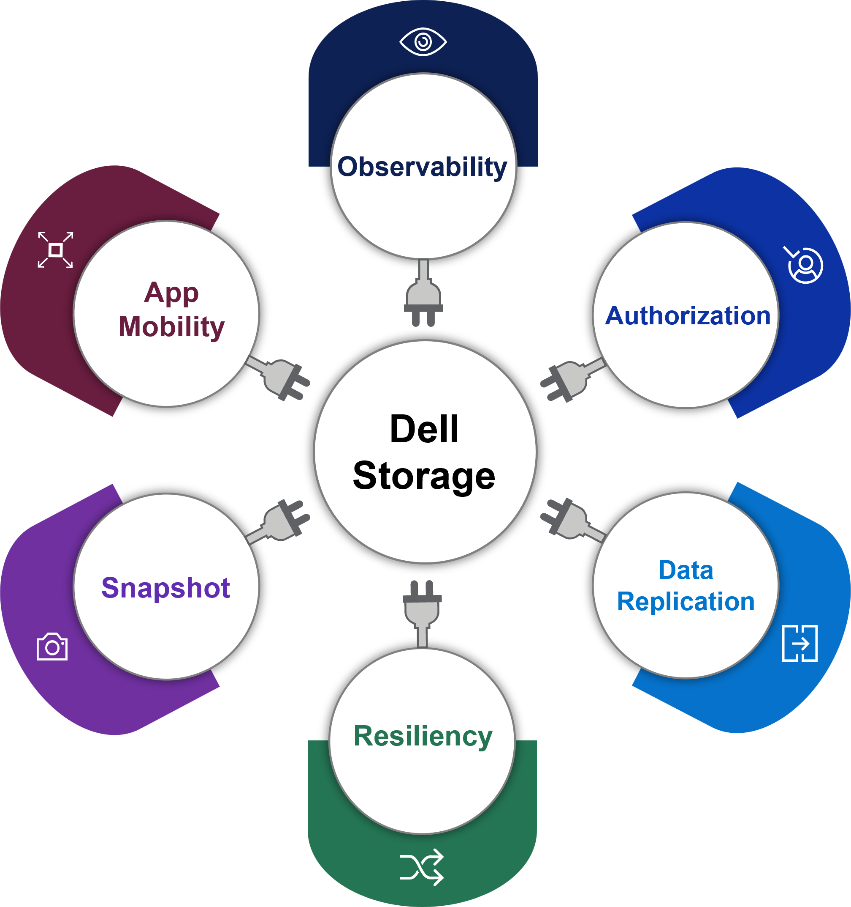

---
title: "Documentation"
linkTitle: "Documentation"
---
{}
This document version is no longer actively maintained. The site that you are currently viewing is an archived snapshot. For up-to-date documentation, see the [latest version](/csm-docs/)
{}

The Dell Container Storage Modules (CSM) enables simple and consistent integration and automation experiences, extending enterprise storage capabilities to Kubernetes for cloud-native stateful applications. It reduces management complexity so developers can independently consume enterprise storage with ease and automate daily operations such as provisioning, snapshotting, replication, observability, authorization and, resiliency.

CSM is made up of multiple components including modules (enterprise capabilities), CSI drivers (storage enablement) and, other related applications (deployment, feature controllers, etc).

## CSM Supported Modules and Dell EMC CSI Drivers

| Modules/Drivers | CSM 1.0 | [Previous](../v1/) | [Older](../v2/) | [Archives](../v3) | 
| - | :-: | :-: | :-: | :-: |
| Authorization | 1.0 | - | - | - |
| Observability | 1.0 | - | - | - |
| Replication | 1.0 | - | - | - |
| Resiliency | 1.0 | - | - | - |
| CSI Driver for PowerScale | v2.0 | v1.6 | v1.5 | v1.4 | 
| CSI Driver for Unity | v2.0 | v1.6 | v1.5 | v1.3 |
| CSI Driver for PowerStore | v2.0 | v1.4 | v1.3 | v1.2 |
| CSI Driver for PowerFlex | v2.0 | v1.5 | v1.4 | v1.3 |
| CSI Driver for PowerMax | v2.0 | v1.7 | v1.6 | v1.5 |
