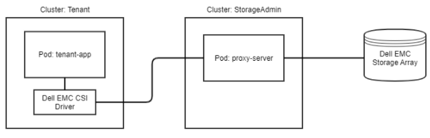

{}

{}

The following diagram shows a high-level overview of CSM for Authorization with a `tenant-app` that is using a CSI driver to perform storage operations through the CSM for Authorization `proxy-server` to access the a Dell storage system. All requests from the CSI driver will contain the token for the given tenant that was granted by the Storage Administrator.

## CSM for Authorization Capabilities

| Feature | PowerFlex | PowerMax | PowerScale | Unity XT | PowerStore |
| - | - | - | - | - | - |
| Ability to set storage quota limits to ensure k8s tenants are not overconsuming storage | Yes | Yes | No (natively supported) | No | No |
| Ability to create access control policies to ensure k8s tenant clusters are not accessing storage that does not belong to them | Yes | Yes | No (natively supported) | No | No |
| Ability to shield storage credentials from Kubernetes administrators ensuring credentials are only handled by storage admins | Yes | Yes | Yes | No | No |


**NOTE:** PowerScale OneFS implements its own form of Role-Based Access Control (RBAC). CSM for Authorization does not enforce any role-based restrictions for PowerScale. To configure RBAC for PowerScale, refer to the PowerScale OneFS [documentation](https://www.dell.com/support/home/en-us/product-support/product/isilon-onefs/docs).

## Authorization Components Support Matrix
Authorization consists of two main components - the Authorization Sidecar and the Authorization Proxy Server. The Authorization Sidecar is bundled with the CSI driver, and the Authorization Proxy Server validates access to storage platforms.

Users should always install or upgrade the Authorization proxy server and sidecar from the same release. This practice helps ensure optimal performance and compatibility, avoiding potential issues from version discrepancies.

**NOTE:** If the number of controller pods deployed by the CSI driver matches the number of scheduled nodes in your cluster, Authorization may not be able to inject properly into the driver's controller pod.
To resolve this, please refer to our [troubleshooting guide](./troubleshooting) on the topic.

## Roles and Responsibilities

The CSM for Authorization CLI can be executed in the context of the following roles:
- Storage Administrators
- Kubernetes Tenant Administrators

### Storage Administrators

Storage Administrators can perform the following operations within CSM for Authorization

- Tenant Management (create, get, list, delete, bind roles, unbind roles)
- Token Management (generate, revoke)
- Storage System Management (create, get, list, update, delete)
- Storage Access Roles Management (assign to a storage system with an optional quota)

### Tenant Administrators

Tenants of CSM for Authorization can use the token provided by the Storage Administrators in their storage requests.

### Workflow

1) Tenant Admin requests storage from a Storage Admin.
2) Storage Admin uses CSM Authorization CLI to: 
    a) Create a tenant resource. 
    b) Create a role permitting desired storage access. 
    c) Assign the role to the tenant and generate a token. 
3) Storage Admin returns a token to the Tenant Admin.
4) Tenant Admin inputs the Token into their Kubernetes cluster as a Secret.
5) Tenant Admin updates CSI driver with CSM Authorization sidecar module.

