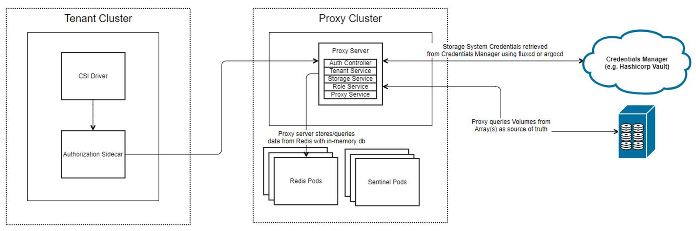

The following diagram shows a high-level overview of CSM for Authorization with a `tenant-app` that is using a CSI driver to perform storage operations through the CSM for Authorization `proxy-server` to access the a Dell storage system. All requests from the CSI driver will contain the token for the given tenant that was granted by the Storage Administrator.



### Diagram Explanation

The diagram above illustrates the end-to-end communication flow:

1. **Tenant Application** sends a storage request (e.g., create volume) via a PersistentVolumeClaim.
2. **CSI Driver** intercepts the request. An **Authorization sidecar proxy** is injected alongside the CSI driver, which attaches the tenant's access token to every outgoing storage request.
3. The request is forwarded to the **CSM Authorization Proxy Server** (exposed via an Ingress controller, typically NGINX).
4. The **Proxy Server** validates the access token, evaluates RBAC policies via Open Policy Agent (OPA), checks quota limits against Redis, and — if approved — proxies the request to the **backend Dell storage array** (e.g., PowerFlex, PowerMax, or PowerScale) using credentials stored in **HashiCorp Vault**.
5. The storage array processes the request and returns the response back through the proxy to the CSI driver.

> **Key point**: The CSI driver and the storage array are unaware that authorization is taking place. The proxy transparently intercepts and validates all requests.

This is the introduction to a Stateless Architecture for Authorization. The creation of storage, roles, and tenants is done through Custom Resources (CRs) which are tracked and contained within CSM Authorization. The underlying communication is consistent with the previous architecture which makes the creation of volumes and snapshots seamless.

## Token Types and Lifecycle

CSM Authorization uses three types of JSON Web Tokens (JWTs):

### Admin Token

- **Purpose**: Used by the Storage Administrator to authenticate with the CSM Authorization Proxy Server for administrative operations (e.g., generating tenant tokens).
- **Generated by**: `dellctl admin token` command, using the JWT signing secret configured during CSM Authorization installation (the `web.jwtsigningsecret` in `karavi-config-secret`).
- **Default expiration**: Access token = 1 minute, Refresh token = 720 hours (30 days).
- **Who can generate it**: Only a user who knows the JWT signing secret (i.e., the Storage Administrator who installed CSM Authorization).

### Access Token (Tenant)

- **Purpose**: A short-lived token attached to every storage request by the Authorization sidecar proxy. The Proxy Server validates this token to authorize the request.
- **Default expiration**: 30 minutes (configurable via `--access-token-expiration` during token generation).
- **Behavior on expiry**: When the access token expires, the sidecar proxy automatically requests a new access token using the refresh token. **No manual intervention is required.**

### Refresh Token (Tenant)

- **Purpose**: A longer-lived token used to obtain new access tokens without requiring the tenant to re-authenticate.
- **Default expiration**: 1480 hours (~61 days) (configurable via `--refresh-token-expiration` during token generation).
- **Behavior on expiry**: If the refresh token expires (e.g., the CSI driver is stopped for a period longer than the refresh token lifetime), **the Storage Administrator must generate a new token pair** using `dellctl generate token` and the Kubernetes Tenant Administrator must re-apply the new `proxy-authz-tokens` secret in the driver namespace.

### Automatic Token Refresh

The Authorization sidecar proxy handles token refresh **automatically**:

1. The sidecar attaches the access token to each storage request sent to the Proxy Server.
2. If the Proxy Server returns HTTP 401 (token expired), the sidecar sends the refresh token along with the expired access token to request a new access token.
3. The Proxy Server validates the refresh token, checks that the tenant has not been revoked, and issues a new access token.
4. The sidecar retries the original request with the new access token.

> **Important**: As long as the refresh token is valid, the token refresh is fully automatic. If the CSI driver pods are stopped for longer than the refresh token expiration period, new tokens must be manually generated and applied.

## Tenant Token Generation — Access and Flow

### Who Can Generate Tokens?

Token generation is a **two-step process** with distinct access requirements:

| Step | Command | Who | Requirements |
| ---- | ------- | --- | ------------ |
| 1. Generate admin token | `dellctl admin token` | Storage Administrator | Must know the JWT signing secret (`web.jwtsigningsecret`) configured during CSM Authorization installation. No Kubernetes cluster access or storage array access is required for this step alone. |
| 2. Generate tenant token | `dellctl generate token` | Storage Administrator | Requires the admin token from Step 1 and network access to the CSM Authorization Proxy Server endpoint (via `--addr`). Does **not** require direct access to the storage array or Unisphere. |

### Communication Path During Token Generation

When generating tenant tokens via `dellctl generate token`:

1. `dellctl` communicates **only with the CSM Authorization Proxy Server** (specified via `--addr`).
2. The Proxy Server validates the admin token and generates the tenant access/refresh token pair.
3. `dellctl` does **not** communicate directly with Unisphere or the storage array during token generation.

> **Note**: Storage array credentials are stored in HashiCorp Vault and are accessed only by the CSM Authorization Proxy Server at runtime when proxying storage requests. Token generation does not involve the storage array.

### Access Requirements Summary

- **Kubernetes cluster access (kubeconfig)** is **not required** for token generation itself. However, the generated token secret must be applied to the tenant's Kubernetes cluster, which requires `kubectl` access to that cluster.
- **Storage array / Unisphere access** is **not required** for token generation. The Proxy Server handles all storage array communication.
- **Any user with the admin token and network access to the Proxy Server** can generate tenant tokens. Token generation is not restricted by Kubernetes RBAC or storage-level permissions — it is controlled by possession of the admin token and the JWT signing secret.

## Kubernetes Secrets Reference

When configuring a CSI driver with CSM Authorization, several Kubernetes secrets are created in the driver namespace. The following table explains each secret:

| Secret Name | Purpose | Contents | How It Is Created |
| ----------- | ------- | -------- | ----------------- |
| `proxy-authz-tokens` | Stores the tenant's access and refresh tokens used by the Authorization sidecar to authenticate with the Proxy Server. | Base64-encoded `access` and `refresh` JWT tokens. | Generated by `dellctl generate token` and applied via `kubectl apply -f token.yaml`. |
| `karavi-authorization-config` | Configures the Authorization sidecar with backend storage array connection information. Tells the sidecar which localhost endpoint to listen on and which storage array the requests are intended for. | JSON configuration with `endpoint` (localhost address the sidecar listens on), `intendedEndpoint` (actual storage array URL), `systemID`, etc. | Created manually from the sample `karavi-authorization-config.json` file in the CSI driver repository. |
| `proxy-server-root-certificate` | Contains the Root CA certificate used to validate TLS connections between the CSI driver's Authorization sidecar and the CSM Authorization Proxy Server. | A PEM-encoded root CA certificate under the key `rootCertificate.pem`. | Created manually. See [proxy-server-root-certificate details](#proxy-server-root-certificate-details) below. |

### proxy-server-root-certificate Details

The `proxy-server-root-certificate` secret enables **secure TLS communication** between:
- The **CSM Authorization sidecar** (running alongside the CSI driver)
- The **CSM Authorization Proxy Server** (exposed via Ingress)

**Where to get `rootCertificate.pem`:**

- If CSM Authorization was installed with a **self-signed certificate** (via cert-manager), you can extract the CA certificate from the cert-manager CA secret in the `authorization` namespace.
- If CSM Authorization was installed with **your own certificate**, provide the **Root CA certificate that signed it**. This is the root of the certificate chain that the Proxy Server's TLS certificate was issued from.
- If running in **insecure mode** (not recommended for production), create the secret with empty data and set `skipCertificateValidation` to `true` in the driver configuration.

**Relationship with `skipCertificateValidation`:**

- `skipCertificateValidation: true` in the driver/sidecar configuration (e.g., `SKIP_CERTIFICATE_VALIDATION` environment variable) causes the sidecar to **skip TLS verification** of the Proxy Server's certificate. In this case, the `proxy-server-root-certificate` secret can be empty.
- `skipCertificateValidation: false` requires the `proxy-server-root-certificate` secret to contain a valid Root CA so the sidecar can verify the Proxy Server's TLS certificate.

> **Note**: The `skipCertificateValidation` parameter in the **Storage CR** (under `spec.skipCertificateValidation`) is a separate setting that controls certificate validation between the **Proxy Server and the backend storage array**, not between the sidecar and the Proxy Server.

## Why CSI Driver Configuration Is Still Required (Step 6)

Even when using the CSM Authorization proxy, the CSI driver still requires configuration (Helm values and/or Kubernetes secrets) because:

1. **Endpoint redirection**: The driver must be configured to send requests to `https://localhost:<port>` (e.g., `https://localhost:9400`) instead of the actual storage array endpoint. This localhost address is where the Authorization sidecar listens and intercepts requests.
2. **Sidecar enablement**: The driver's Helm values must enable the Authorization module and specify the sidecar image, proxy host, and certificate validation settings.
3. **Reverse proxy configuration** (PowerMax only): PowerMax requires the CSI Reverse Proxy to be configured as a sidecar and pointed to the localhost endpoint.

The driver credentials (`username`/`password`) are ignored when Authorization is enabled — the Proxy Server uses credentials from Vault instead. However, the fields must still be present in the configuration (they can be left as placeholder values).

## Exposing the CSM Authorization Proxy Server

By default, CSM Authorization deploys an **NGINX Ingress Controller** to expose the Proxy Server outside the Kubernetes cluster. However, NGINX is **not mandatory**.

### Using NGINX (Default)

The Helm chart includes an optional NGINX Ingress Controller deployment (`nginx.enabled: true`). This creates an Ingress resource for the `proxy-server` service. Set `nginx.enabled: false` if you already have an Ingress Controller installed in your cluster.

## CSM for Authorization Capabilities

| Feature                                                                                                                        | PowerFlex | PowerMax | PowerScale |
| ------------------------------------------------------------------------------------------------------------------------------ | --------- | -------- | ---------- |
| Ability to set storage quota limits to ensure k8s tenants are not overconsuming storage                                        | Yes       | Yes      | No         |
| Ability to create access control policies to ensure k8s tenant clusters are not accessing storage that does not belong to them | Yes       | Yes      | No         |
| Ability to shield storage credentials from Kubernetes administrators by storing them in vault                                  | Yes       | Yes      | Yes        |
| Ability to create snapshots from owned volumes that consume the storage quota                                                  | Yes       | Yes      | Yes        |
| Ability to periodically query storage array to keep quota consumption in sync                                                  | Yes       | Yes      | No         |


### Snapshot Support

As stated above, all snapshot requests that are associated with a volume that has been approved and created will go through a similar authorization processes ensuring that the snapshot fits within the allotted quota.

```yaml
apiVersion: snapshot.storage.k8s.io/v1
kind: VolumeSnapshot
metadata:
  name: vol1-snapshot
spec:
  volumeSnapshotClassName: vxflexos-snapclass
  source:
    persistentVolumeClaimName: vol1
```

This will take a snapshot of the `persistent volume claim` named `vol1`. CSM Authorization will verify ownership with Redis to ensure that the tenant who is attempting to create the snapshot owns the `vol1` volume. If the tenant does own the volume, authorization will proceed to check to see if the snapshot fits within the allotted quota and add a record if it does.

### Backend Storage Polling

A configurable polling mechanism has been introduced to ensure that the tenant and Redis are always in sync with the backend storage configured. This is determined by the [volumePrefix](configuration#configuring-tenants) specified for the `tenant`. During polling, for each of the tenants and roles, the storage service will ensure that nothing has been removed or added by the storage admin which would lead to Redis being out of sync.

If a volume is created with the matching `volumePrefix`, the new entry will be added to Redis and the available quota will be consumed accordingly. Similarly, if a snapshot is created from a volume that is owned by the tenant in the backend storage array, that will be added to Redis.

Lastly, if there is any deletion on the backend storage array of a volume or snapshot that is owned by the tenant, that entry will be deleted from Redis and the available capacity will reflect accordingly.

## Roles and Responsibilities

The Stateless CSM Authorization contains the following roles:
- Storage Administrators
- Kubernetes Tenant Administrators

### Storage Administrators

Storage Administrators perform the following:

- Storage System Management (create, get, delete)
- Role Management (create, get, delete)
- Tenant Management (create, get, delete)
- Token Management (create, revoke)

For more information on the configuration of the above, see the configuration of the [Proxy Server](../v2.x/configuration/#configuring-storage).

### Tenant Administrators

Tenants of CSM for Authorization can use the token provided by the Storage Administrators in their storage requests.

For more information on how to use the token and configuration, see configuration for the [PowerFlex driver](../v2.x/configuration/powerflex), [PowerMax driver](../v2.x/configuration/powermax), or the [PowerScale driver](../v2.x/configuration/powerscale).