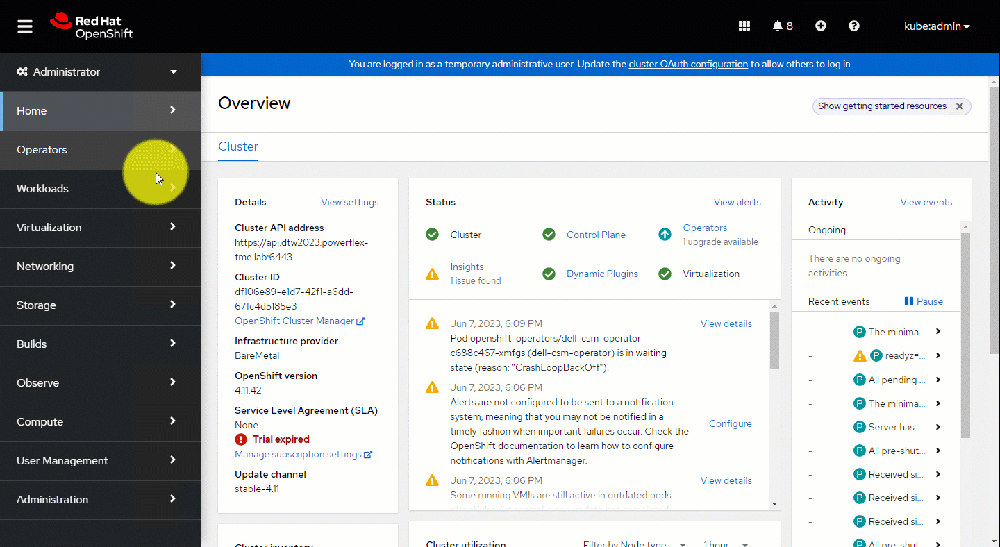

{}

{}
The Dell Container Storage Modules Operator is a Kubernetes Operator, which can be used to install and manage the CSI Drivers and CSM Modules provided by Dell for various storage platforms. This operator is available as a community operator for upstream Kubernetes and can be deployed using OperatorHub.io. The operator can be installed using OLM (Operator Lifecycle Manager) or manually.

## Supported CSM Components

The table below lists the driver and modules versions installable with the CSM Operator:

| CSI Driver         | Version | CSM Authorization 1.x.x , 2.x.x | CSM Replication | CSM Observability | CSM Resiliency |
| ------------------ |---------|---------------------------------|-----------------|-------------------|----------------|
| CSI PowerScale     | 2.12.0  | ✔ 1.12.0  , 2.0.0              | ✔ 1.10.0       | ✔ 1.10.0          | ✔ 1.11.0      |
| CSI PowerScale     | 2.11.0  | ✔ 1.11.0  , ❌             | ✔ 1.9.0        | ✔ 1.9.0           | ✔ 1.10.0      |
| CSI PowerScale     | 2.10.1  | ✔ 1.10.1  , ❌             | ✔ 1.8.1        | ✔ 1.8.1           | ✔ 1.9.1       |
| CSI PowerFlex      | 2.12.0  | ✔ 1.12.0  , 2.0.0           | ✔ 1.10.0       | ✔ 1.10.0          | ✔ 1.11.0      |
| CSI PowerFlex      | 2.11.0  | ✔ 1.11.0  , ❌             | ✔ 1.9.0        | ✔ 1.9.0           | ✔ 1.10.0      |
| CSI PowerFlex      | 2.10.1  | ✔ 1.10.1  , ❌             | ✔ 1.8.1        | ✔ 1.8.1           | ✔ 1.9.1       |
| CSI PowerStore     | 2.12.0  | ❌ , ❌                    | ❌             | ❌                | ✔ 1.11.0      |
| CSI PowerStore     | 2.11.1  | ❌ , ❌                    | ❌             | ❌                | ✔ 1.10.0      |
| CSI PowerStore     | 2.10.1  | ❌ , ❌                    | ❌             | ❌                | ✔ 1.9.1       |
| CSI PowerMax       | 2.12.0  | ✔ 1.12.0  , 2.0.0           | ✔ 1.10.0       | ✔ 1.10.0          | ✔ 1.11.0      |
| CSI PowerMax       | 2.11.0  | ✔ 1.11.0  , ❌             | ✔ 1.9.0        | ✔ 1.9.0           | ✔ 1.10.0      |
| CSI PowerMax       | 2.10.1  | ✔ 1.10.1  , ❌             | ✔ 1.8.1        | ✔ 1.8.1           | ❌            |
| CSI Unity XT       | 2.12.0  | ❌ , ❌                    | ❌             | ❌                | ❌            |
| CSI Unity XT       | 2.11.1  | ❌ , ❌                    | ❌             | ❌                | ❌            |
| CSI Unity XT       | 2.10.1  | ❌ , ❌                    | ❌             | ❌                | ❌            |

These CR will be used for new deployment or upgrade. In most case, it is recommended to use the latest available version.

The full compatibility matrix of CSI/CSM versions for the CSM Operator is available [here](../../prerequisites/#csm-operator-compatibility-matrix)

## Installation

Dell CSM Operator can be installed manually or via Operator Hub.

Once installed you will be able to deploy [drivers](drivers) and [modules](modules) from the Operator.

### OpenShift Installation via Operator Hub
>NOTE: You can update the resource requests and limits when you are deploying operator using Operator Hub

`dell-csm-operator` can be installed via Operator Hub on upstream Kubernetes clusters & Red Hat OpenShift Clusters.

The installation process involves the creation of a `Subscription` object either via the _OperatorHub_ UI or using `kubectl/oc`. While creating the `Subscription` you can set the Approval strategy for the `InstallPlan` for the operator to:
* _Automatic_ - If you want the operator to be automatically installed or upgraded (once an upgrade is available).
* _Manual_ - If you want a cluster administrator to manually review and approve the `InstallPlan` for installation/upgrades.



### Certified vs Community

Dell CSM Operator is distributed as both `Certified` & `Community` editions.

Both editions have the same codebase and are supported by Dell Technologies, the only differences are:

* The `Certified` version is officially supported by Redhat by partnering with software vendors.
* The `Certified` version is often released couple of days/weeks after the `Community` version.
* The `Certified` version is specific to Openshift and can only be installed on specific Openshift versions where it is certified.
* The `Community` can be installed on any Kubernetes distributions.

### Manual Installation on a cluster without OLM
>NOTE: You can update the resource requests and limits when you are deploying operator using manual installation without OLM

1. Install volume snapshot CRDs. For detailed snapshot setup procedure, [click here](../../snapshots/#volume-snapshot-feature).
2. Clone and checkout the required csm-operator version using
```bash
git clone -b v1.7.0 https://github.com/dell/csm-operator.git
```
3. `cd csm-operator`
4. _(Optional)_ If using a local Docker image, edit the `deploy/operator.yaml` file and set the image name for the CSM Operator Deployment.
5. _(Optional)_ The Dell CSM Operator might need more resources if users have larger environment (>1000 Pods). You can modify the default resource requests and limits in the files `deploy/operator.yaml`, `config/manager/manager.yaml`  and increase the values for cpu and memory. More information on setting the resource requests and limits can be found [here](https://sdk.operatorframework.io/docs/best-practices/managing-resources/). Current default values are set as below:
    ```yaml
        resources:
          limits:
            cpu: 200m
            memory: 512Mi
          requests:
            cpu: 100m
            memory: 192Mi
    ```
6. _(Optional)_ If **CSM Replication** is planned for use and will be deployed using two clusters in an environment where the DNS is not configured, and cluster API endpoints are FQDNs, in order to resolve queries to remote API endpoints, it is necessary to edit the `deploy/operator.yaml` file and add the `hostAliases` field and associated `<FQDN>:<IP>` mappings to the CSM Operator Controller Manager Deployment under `spec.template.spec`. More information on host aliases can be found, [here](https://kubernetes.io/docs/tasks/network/customize-hosts-file-for-pods/).
    ```yaml
    # example config
    apiVersion: apps/v1
    kind: Deployment
    metadata:
      name: dell-csm-operator-controller-manager
    spec:
      template:
        spec:
          hostAliases:
          - hostnames:
            - "remote.FQDN"
            ip: "255.255.255.1"
    ```
7. Run `bash scripts/install.sh` to install the operator.

>NOTE: Dell CSM Operator will be installed in the `dell-csm-operator` namespace.

>NOTE: If you want to update the resource requests and limits configuration after the operator is installed. Follow the steps below:

     * Uninstall the operator following the steps [here](https://dell.github.io/csm-docs/v3/deployment/csmoperator/#uninstall)

     * Update the resource configuration as mentioned in step 5 and install the operator using the step 7 above




8. Run the command to validate the installation.
```bash
kubectl get pods -n dell-csm-operator
```
 If installed successfully, you should be able to see the operator pod in the `dell-csm-operator` namespace.



### Offline Bundle Installation on a cluster without OLM

The `csm-offline-bundle.sh` script can be used to create a package usable for offline installation of Dell CSI Drivers via CSM Operator

#### Dependencies

Multiple Linux-based systems may be required to create and process an offline bundle for use.
* One Linux-based system, with Internet access, will be used to create the bundle. This involves the user cloning a git repository hosted on github.com and then invoking a script that utilizes `docker` or `podman` to pull and save container images to file.
* One Linux-based system, with access to an image registry, to invoke a script that uses `docker` or `podman` to restore container images from file and push them to a registry
* RedHat credentials to pull `openshift4/ose-kube-rbac-proxy-rhel9` image from `registry.redhat.io` (This registry does not support unauthenticated access)

If one Linux system has both Internet access and access to an internal registry, that system can be used for both steps.

Preparing an offline bundle requires the following utilities:

| Dependency            | Usage |
| --------------------- | ----- |
| `docker` or `podman`  | `docker` or `podman` will be used to pull images from public image registries, tag them, and push them to a private registry. |
|                       | One of these will be required on both the system building the offline bundle as well as the system preparing for installation. |
|                       | Tested version(s) are `docker` 24.0.5 and `podman` 4.4.1 |
| `git`                 | `git` will be used to manually clone one of the above repositories in order to create an offline bundle. |
|                       | This is only needed on the system preparing the offline bundle. |
|                       | Tested version(s) are `git` 2.39.3 but any version should work. |

#### Workflow

To perform an offline installation, the following steps should be performed:

1. Build an offline bundle
2. Unpack the offline bundle created in Step 1 and prepare for installation
3. Perform operator installation using the files obtained after unpacking in Step 2
4. Perform driver installation using the files obtained after unpacking in Step 2

>NOTE: It is recommended to use the same build tool for packing and unpacking of images (either docker or podman).

#### Building an offline bundle
>NOTE: Login to the `registry.redhat.io` registry using RedHat credentials before you proceed with offline bundle creation.

This needs to be performed on a Linux system with access to the Internet as a git repo will need to be cloned, and container images pulled from public registries.

To build an offline bundle, the following steps are needed:
1. Clone and checkout the required csm-operator version using
```bash
git clone -b v1.7.0 https://github.com/dell/csm-operator.git
```
2. `cd csm-operator`
3. Run the `csm-offline-bundle.sh` script which will be found in the `scripts` directory with an argument of `-c` in order to create an offline bundle
```bash
bash scripts/csm-offline-bundle.sh -c
```

The script will perform the following steps:
  - Determine required images by parsing CSM Operator configuration files
  - Perform an image `pull` of each image required
  - Save all required images to a file by running `docker save` or `podman save`
  - Build a `tar.gz` file containing the images as well as files required to install the Operator and drivers.

Here is the output of a request to build an offline bundle for the Dell CSM Operator:

```
* Building image manifest file

   Processing file /root/csm-operator/operatorconfig/driverconfig/common/default.yaml
   Processing file /root/csm-operator/bundle/manifests/dell-csm-operator.clusterserviceversion.yaml

* Pulling and saving container images

   quay.io/dell/container-storage-modules/csi-isilon:v2.12.0
   quay.io/dell/container-storage-modules/csi-metadata-retriever:v1.9.0
   quay.io/dell/container-storage-modules/csipowermax-reverseproxy:v2.11.0
   quay.io/dell/container-storage-modules/csi-powermax:v2.12.0
   quay.io/dell/container-storage-modules/csi-powerstore:v2.12.0
   quay.io/dell/container-storage-modules/csi-unity:v2.12.0
   quay.io/dell/container-storage-modules/csi-vxflexos:v2.12.0
   quay.io/dell/container-storage-modules/csm-authorization-sidecar:v1.12.0
   quay.io/dell/container-storage-modules/csm-metrics-powerflex:v1.10.0
   quay.io/dell/container-storage-modules/csm-metrics-powerscale:v1.7.0
   quay.io/dell/container-storage-modules/csm-topology:v1.10.0
   quay.io/dell/container-storage-modules/dell-csi-replicator:v1.10.0
   quay.io/dell/container-storage-modules/dell-replication-controller:v1.10.0
   dellemc/sdc:4.5.2.1
   quay.io/dell/container-storage-modules/dell-csm-operator:v1.7.0
   registry.redhat.io/openshift4/ose-kube-rbac-proxy-rhel9:v4.16.0-202409051837.p0.g8ea2c99.assembly.stream.el9
   nginxinc/nginx-unprivileged:1.20
   otel/opentelemetry-collector:0.42.0
   registry.k8s.io/sig-storage/csi-attacher:v4.7.0
   registry.k8s.io/sig-storage/csi-external-health-monitor-controller:v0.13.0
   registry.k8s.io/sig-storage/csi-node-driver-registrar:v2.12.0
   registry.k8s.io/sig-storage/csi-provisioner:v5.1.0
   registry.k8s.io/sig-storage/csi-resizer:v1.12.0
   registry.k8s.io/sig-storage/csi-snapshotter:v8.1.0

* Copying necessary files

 /root/csm-operator/deploy
 /root/csm-operator/operatorconfig
 /root/csm-operator/samples
 /root/csm-operator/scripts
 /root/csm-operator/README.md
 /root/csm-operator/LICENSE

* Compressing release

dell-csm-operator-bundle/
dell-csm-operator-bundle/deploy/
dell-csm-operator-bundle/deploy/operator.yaml
dell-csm-operator-bundle/deploy/crds/
dell-csm-operator-bundle/deploy/crds/storage.dell.com_containerstoragemodules.yaml
dell-csm-operator-bundle/deploy/olm/
dell-csm-operator-bundle/deploy/olm/operator_community.yaml
...
...
dell-csm-operator-bundle/README.md
dell-csm-operator-bundle/LICENSE

* Complete

Offline bundle file is: /root/csm-operator/dell-csm-operator-bundle.tar.gz
```

The resulting offline bundle file can be copied to another machine, if necessary, to gain access to the desired image registry.

#### Unpacking the offline bundle and preparing for installation

This step needs to be performed on a Linux system with access to an image registry that will host container images. If the registry requires `login`, that should be done before proceeding.

To prepare for Operator installation, the following steps need to be performed:
1. Copy the offline bundle file created from the previous step to a system with access to an image registry available to your Kubernetes/OpenShift cluster
2. Expand the bundle file by running `tar xvfz <filename>`
```bash
tar xvfz dell-csm-operator-bundle.tar.gz
```
Here is the output of untar
```
dell-csm-operator-bundle/
dell-csm-operator-bundle/deploy/
dell-csm-operator-bundle/deploy/operator.yaml
dell-csm-operator-bundle/deploy/crds/
dell-csm-operator-bundle/deploy/crds/storage.dell.com_containerstoragemodules.yaml
dell-csm-operator-bundle/deploy/olm/
dell-csm-operator-bundle/deploy/olm/operator_community.yaml
...
...
dell-csm-operator-bundle/README.md
dell-csm-operator-bundle/LICENSE
```
3. Run the `csm-offline-bundle.sh` script and supply the `-p` option as well as the path to the internal registry with the `-r` option
```bash
cd dell-csm-operator-bundle
```
```bash
bash scripts/csm-offline-bundle.sh -p -r localregistry:5000/dell-csm-operator/
```

The script will then perform the following steps:
  - Load the required container images into the local system
  - Tag the images according to the user-supplied registry information
  - Push the newly tagged images to the registry
  - Modify the Operator configuration to refer to the newly tagged/pushed images

Here is the output for preparing the bundle for installation (`localregistry:5000` refers to an image registry accessible to Kubernetes/OpenShift. `dell-csm-operator` refers to the folder created within the registry.):

```
Preparing a offline bundle for installation

* Loading quay.io images

Loaded image: quay.io/dell/container-storage-modules/csi-powerstore:v2.12.0
Loaded image: quay.io/dell/container-storage-modules/csi-isilon:v2.12.0
...
...
Loaded image: registry.k8s.io/sig-storage/csi-resizer:v1.12.0
Loaded image: registry.k8s.io/sig-storage/csi-snapshotter:v8.1.0

* Tagging and pushing images

   quay.io/dell/container-storage-modules/csi-isilon:v2.12.0 -> localregistry:5000/dell-csm-operator/csi-isilon:v2.12.0
   quay.io/dell/container-storage-modules/csi-metadata-retriever:v1.9.0 -> localregistry:5000/dell-csm-operator/csi-metadata-retriever:v1.9.0
   ...
   ...
   registry.k8s.io/sig-storage/csi-resizer:v1.12.0 -> localregistry:5000/dell-csm-operator/csi-resizer:v1.12.0
   registry.k8s.io/sig-storage/csi-snapshotter:v8.1.0 -> localregistry:5000/dell-csm-operator/csi-snapshotter:v8.1.0

* Preparing files within /root/dell-csm-operator-bundle

   changing: quay.io/dell/container-storage-modules/csi-isilon:v2.12.0 -> localregistry:5000/dell-csm-operator/csi-isilon:v2.12.0
   changing: quay.io/dell/container-storage-modules/csi-metadata-retriever:v1.9.0 -> localregistry:5000/dell-csm-operator/csi-metadata-retriever:v1.9.0
   ...
   ...
   changing: registry.k8s.io/sig-storage/csi-resizer:v1.12.0 -> localregistry:5000/dell-csm-operator/csi-resizer:v1.12.0
   changing: registry.k8s.io/sig-storage/csi-snapshotter:v8.1.0 -> localregistry:5000/dell-csm-operator/csi-snapshotter:v8.1.0

* Complete
```

#### Perform Operator installation

Now that the required images are available and the Operator configuration updated, you can proceed to install the operator by executing `install.sh` script.
```bash
bash scripts/install.sh
```
>NOTE: Dell CSM Operator would install to the 'dell-csm-operator' namespace by default.

## Uninstall

### Operator uninstallation on a cluster without OLM

To uninstall a CSM operator, run `bash scripts/uninstall.sh`. This will uninstall the operator in `dell-csm-operator` namespace.



## Upgrade

### Dell CSM Operator

Dell CSM Operator can be upgraded in 2 ways:

1. Using Operator Lifecycle Manager (OLM)

2. Using script (for non-OLM based installation)

#### Using OLM

The upgrade of the Dell CSM Operator is done via Operator Lifecycle Manager.

The `Update approval` (**`InstallPlan`** in OLM terms) strategy plays a role while upgrading dell-csm-operator on OpenShift. This option can be set during installation of dell-csm-operator on OpenShift via the console and can be either set to `Manual` or `Automatic`.
- If the **`Update approval`** is set to `Automatic`, OpenShift automatically detects whenever the latest version of dell-csm-operator is available in the **`Operator hub`**, and upgrades it to the latest available version.
- If the upgrade policy is set to `Manual`, OpenShift notifies of an available upgrade. This notification can be viewed by the user in the **`Installed Operators`** section of the OpenShift console. Clicking on the hyperlink to `Approve` the installation would trigger the dell-csm-operator upgrade process.

>NOTE: The recommended version of OLM for Upstream Kubernetes is **`v0.25.0`**.

#### Using Installation Script

1. Clone and checkout the required csm-operator version using
```bash
git clone -b v1.7.0 https://github.com/dell/csm-operator.git
```
2. `cd csm-operator`
3. Execute `bash scripts/install.sh --upgrade`  . This command will install the latest version of the operator.

>NOTE: Dell CSM Operator would install to the 'dell-csm-operator' namespace by default.

### Upgrading Drivers with Dell CSM Operator
You can update CSI Drivers installed by the Dell CSM Operator like any Kubernetes resource:

1. </b>Modify Installation via kubectl edit:</b></br>

```bash
kubectl get <driver-object> -n <driver-namespace>
```
2. Replace `<driver-namespace>` with the appropriate namespace. For example, to get the CSI PowerStore driver object: </br>
```bash
kubectl get csm -n <driver-namespace>
```
Use the object name in the kubectl edit command: </br>

```bash
kubectl edit csm <driver-object>/<object-name> -n <driver-namespace>
```
For example, if the object name is powerstore:</br>

```bash
kubectl edit csm powerstore -n <driver-namespace>
```

Modify the installation as needed, typically updating driver versions, sidecars, and environment variables.

3. Refer how to [upgrade](https://infohub.delltechnologies.com/en-us/p/best-practices-for-deployment-and-life-cycle-management-of-dell-csm-modules-1/#:~:text=Upgrades%20with%20Operator) guide if you have more questions </br>

> Note: Starting with CSM 1.12, use images from [quay.io](https://quay.io/organization/dell). From CSM 1.14 (May 2025), editing the CSM object will fail if using images from [Docker Hub](https://hub.docker.com/r/dellemc/).

### Upgrade Modules using Dell CSM Operator

* Refer [Upgrade Obsevability Module](./modules/observability/#upgrade-observability) to upgrade the Observability Module via Operator

* Refer [Upgrade Authorization Module](./modules/authorizationv1-x/#upgrade-csm-authorization) to upgrade the Authorization Module via Operator

## Custom Resource Definitions

As part of the Dell CSM Operator installation, a CRD representing configuration for the CSI Driver and CSM Modules is also installed.
`containerstoragemodule` CRD is installed in API Group `storage.dell.com`.

Drivers and modules can be installed by creating a `customResource`.

### Custom Resource Specification

Each CSI Driver and CSM Module installation is represented by a Custom Resource.

The specification for the Custom Resource is the same for all the drivers.Below is a list of all the mandatory and optional fields in the Custom Resource specification

#### Mandatory fields

**configVersion** - Configuration version - refer [here](#supported-csi-drivers) for appropriate config version.

**replicas**  - Number of replicas for controller plugin - must be set to 1 for all drivers.

**dnsPolicy** - Determines the dnsPolicy for the node daemonset. Accepted values are `Default`, `ClusterFirst`, `ClusterFirstWithHostNet`, `None`.

**common** - This field is mandatory and is used to specify common properties for both controller and the node plugin.

* image - driver container image
* imagePullPolicy - Image Pull Policy of the driver image
* envs - List of environment variables and their values

#### Optional fields

**controller** - List of environment variables and values which are applicable only for controller.

**node** - List of environment variables and values which are applicable only for node.

**sideCars** - Specification for CSI sidecar containers.

**tlsCertSecret** - Name of the TLS cert secret for use by the driver. If not specified, a secret *-certs must exist in the namespace as driver.

**tolerations** - List of tolerations which should be applied to the driver StatefulSet/Deployment and DaemonSet. It should be set separately in the controller and node sections if you want separate set of tolerations for them.

**nodeSelector** - Used to specify node selectors for the driver StatefulSet/Deployment and DaemonSet.

>NOTE: The `image` field should point to the correct image tag for version of the driver you are installing.

>NOTE: The CSM Operator 1.6 is pre-requisite for onboarding brownfield clusters with Apex Navigator For Kubernetes. When the Dell connectivity client is installed, a role and rolebinding will be established in the namespace containing CSM objects, and these will be removed when the client is uninstalled. If the client is already present in the cluster and CSM is deployed or deleted, the roles and rolebindings will be correspondingly created or removed during CSM reconciliation. This process ensures that the client can access the secrets in the namespace.
