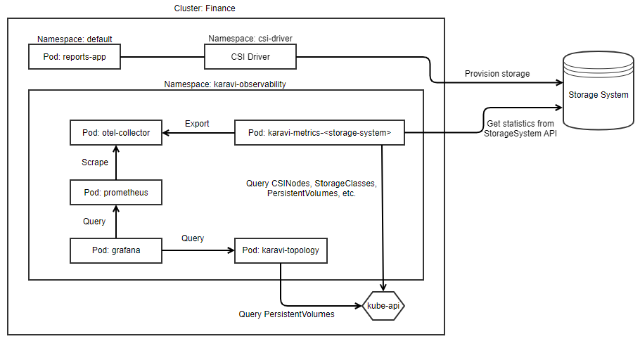
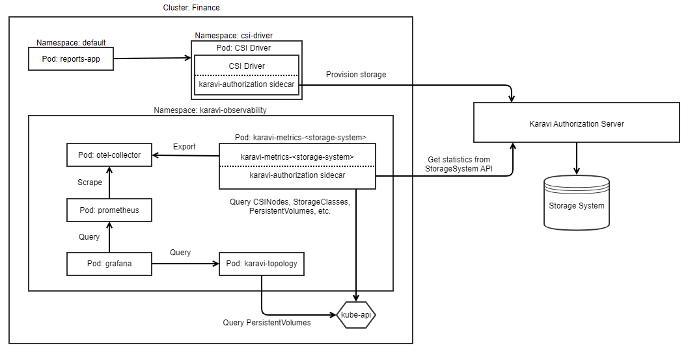

The solution takes the approach that each storage system that Container Storage Modules (CSM) for Observability supports will have their own metrics deployments in the Kubernetes cluster.

- Metrics Deployment: Queries the Kubernetes API to gather information about storage resources and then queries the storage system's REST API to gather specific metrics. These metrics are then exported to the [OTEL collector](https://github.com/open-telemetry/opentelemetry-collector).
- Each supported storage system will have their own Deployment for metrics. They will each follow a similar pattern of querying the Kubernetes and StorageSystem APIs to gather information about storage resources (ex: volumes, storage pools, etc) and their metrics. Metrics will be exported directly to the OTEL collector.

A single topology deployment will query the Kubernetes API to gather mapping information between Persistent Volumes and storage resources located on multiple storage systems. This information is queried directly from Grafana and displayed in a custom dashboard.

## Required Components

The following prerequisites must be deployed into the namespace where CSM for Observability is located to support the storage system metrics and topology deployments:

- Prometheus for scraping the metrics from the OTEL collector.
- Grafana for visualizing the metrics from Prometheus and Topology services using custom dashboards.
- CSM for Observability will use secrets to get details about the storage systems used by the CSI drivers. These secrets should be copied from the namespaces where the drivers are deployed. CSI Powerflex driver uses the 'vxflexos-config' secret and CSI PowerStore uses the 'powerstore-config' secret.

## Deployment Architectures

CSM for Observability can be deployed to either direct storage system requests directly to the storage system or through the [CSM for Authorization](../../authorization) proxy.  The CSI driver must be configured to route storage system requests through the CSM for Authorization proxy in order for CSM for Observability to do the same.

### Default Deployment of CSM for Observability

### Deployment of CSM for Observability with CSM for Authorization

